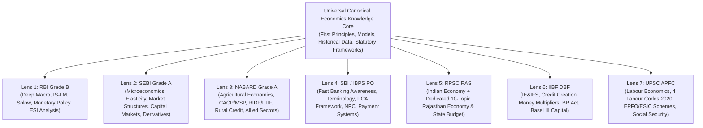

# Economics Master Curriculum Architecture & Rebuilding Blueprint

**Phase**: Economics Batch 0 Forensic Audit & Master Curriculum Reset  
**Architectural Goal**: One Rigorous Canonical Economics Knowledge Graph with Multi-Exam Lenses  
**Target Examination Universe**: RBI Grade B, SEBI Grade A, NABARD Grade A (Generalist), SBI PO, IBPS PO, RPSC RAS (with Full Rajasthan Economy), IIBF DBF, UPSC APFC  
**Status**: MASTER ARCHITECTURE APPROVED FOR BATCHED SEEDING  
**Date**: 2026-08-29  

---

## 1. Master Design Philosophy



### Core Architecture Axioms:
1. **One Canonical Base, Many Exam Lenses**: Universal economic truths (e.g. Circular Flow, GDP Aggregates, Fractional Reserve Credit Creation, Inflation Mechanics, BoP Identities) exist **once**. Target examinations are applied as structured overlay views (`ExamConceptMapping`).
2. **Dual Prelims + Mains Optimization**: Every substantive concept is engineered to provide fast-recall definitions, formulas, and traps for Prelims, combined with causal chains, policy trade-offs, and analytical frameworks for Mains.
3. **Strict Math/Formatting Discipline**: LaTeX is applied **strictly** where mathematical notation is indispensable ($Y = C + I + G$, $m = \frac{1+c}{r+c}$, $\text{NNP}_{\text{FC}}$). Ordinary economic terms (GDP, RBI, CAD, 5%, 40% PSL) remain clean, unescaped plain text.
4. **Static Core vs Current Affairs Layer**: The static core explains enduring economic principles and statutory frameworks. The current affairs layer links dynamic data (Budget, Monetary Policy statements, CPI releases, PLFS rounds) back to their respective static anchor concepts.

---

## 2. The 15 Canonical Master Domains & Topic Blueprints

The 258-topic initial curriculum hypothesis has been audited and consolidated into **15 Canonical Domains** comprising **105 Atomic Canonical Topics** and **~240 First-Principles Concepts**:

### DOMAIN A — Economic Foundations (5 Topics)
- **Topic A1**: What Is Economics? Scarcity, Choice & Opportunity Cost (`CON-ECO-01`)
- **Topic A2**: The Central Economic Problems & Production Possibility Frontier (PPF)
- **Topic A3**: Economic Systems: Free Market, Command, Mixed & Traditional Economies
- **Topic A4**: Microeconomics vs Macroeconomics, Positive vs Normative Economics
- **Topic A5**: Classification of Goods: Public, Private, Common Resources & Club Goods (`CON-ECO-02`)

### DOMAIN B — Microeconomics (SEBI Grade A & Foundations Core) (10 Topics)
- **Topic B1**: Theory of Demand: Law of Demand, Individual vs Market Demand, Shift vs Movement
- **Topic B2**: Elasticity of Demand: Price, Income & Cross Elasticity (Point, Arc, Total Outlay Methods)
- **Topic B3**: Theory of Supply & Elasticity of Supply
- **Topic B4**: Consumer Behaviour: Cardinal Utility (Law of Diminishing Marginal Utility, Equi-Marginal Utility)
- **Topic B5**: Ordinal Utility: Indifference Curves, Marginal Rate of Substitution (MRS), Budget Line, Consumer Equilibrium
- **Topic B6**: Production Theory: Short-Run Production Function (Law of Variable Proportions), Long-Run (Returns to Scale, Cobb-Douglas)
- **Topic B7**: Cost & Revenue Analysis: Fixed, Variable, Total, Average, Marginal Costs, Economies of Scale
- **Topic B8**: Market Structures: Perfect Competition (Short/Long-Run Equilibrium), Monopoly & Price Discrimination (1st, 2nd, 3rd Degree)
- **Topic B9**: Monopolistic Competition (Chamberlin Excess Capacity) & Oligopoly Models (Cournot, Sweezy Kinked Demand Curve, Collusion)
- **Topic B10**: Factor Markets & Market Failure: Marginal Productivity Theory of Distribution, Externalities, Pigouvian Taxes, Coase Theorem, Asymmetric Information (Moral Hazard, Adverse Selection)

### DOMAIN C — National Income & Macroeconomics (8 Topics)
- **Topic C1**: Circular Flow of Income: 2, 3, and 4-Sector Models, Injections & Leakages (`CON-ECO-03`)
- **Topic C2**: National Income Aggregates: GDP, NDP, GNP, NNP & 2015 SNA Methodology (Factor Cost, Basic Prices, Market Prices) (`CON-ECO-04`)
- **Topic C3**: Methods of Calculating National Income: Production (GVA), Income, Expenditure Approaches (`CON-ECO-05`)
- **Topic C4**: Real vs Nominal GDP, GDP Deflator, Base Year Revisions & Green GDP (`CON-ECO-06`)
- **Topic C5**: Classical vs Keynesian Macroeconomic Frameworks: Say's Law, Effective Demand, Consumption Function, Marginal Propensity to Consume (MPC), Investment Multiplier
- **Topic C6**: The IS-LM Framework: Goods Market Equilibrium (IS Curve), Money Market Equilibrium (LM Curve), Policy Shifts
- **Topic C7**: Theories of Economic Growth: Harrod-Domar Model, Solow-Swan Neoclassical Growth Model, Endogenous Growth
- **Topic C8**: Business Cycles & Macroeconomic Stabilization: Four Phases, Leading/Lagging Indicators, Counter-Cyclical Policy

### DOMAIN D — Inflation, Price Theory & Employment (8 Topics)
- **Topic D1**: Inflation Mechanics: Definitions, Creeping, Galloping, Hyperinflation, Bottleneck Inflation
- **Topic D2**: Demand-Pull vs Cost-Push Inflation, Wage-Price Spiral & Structural Inflation
- **Topic D3**: Measurement of Inflation in India: CPI (Rural, Urban, Combined) vs WPI, Weightage Matrix, Headline vs Core Inflation (`CON-ECO-16`)
- **Topic D4**: Stagflation, Deflation, Disinflation, Reflation & Skewflation Dynamics
- **Topic D5**: Inflation Expectations & The Phillips Curve: Short-Run vs Long-Run (Friedman-Phelps Accelerationist Hypothesis)
- **Topic D6**: Labour Force & Employment Typologies: UPS, UPSS, CWS, LFPR, WPR, Unemployment Rate (`CON-ECO-46`)
- **Topic D7**: Structural, Frictional, Cyclical, Seasonal & Disguised Unemployment in India
- **Topic D8**: Employment Elasticity of Growth & Jobless Growth Phenomena

### DOMAIN E — Money & Monetary Economics (8 Topics)
- **Topic E1**: Money: Functions, Evolution (Commodity, Metallic, Fiat, Legal Tender, Fiduciary, Digital / CBDC) (`CON-ECO-07`)
- **Topic E2**: Money Supply Measures in India: Reserve Money ($M_0$), Narrow Money ($M_1, M_2$), Broad Money ($M_3, M_4$), New Monetary Aggregates ($NM_1, NM_2, NM_3$) (`CON-ECO-08`)
- **Topic E3**: Commercial Banking & Credit Creation Mechanics: High-Powered Money, Currency-Deposit Ratio ($c$), Reserve-Deposit Ratio ($r$), The Money Multiplier ($m = \frac{1+c}{r+c}$) (`CON-ECO-09`)
- **Topic E4**: Central Banking & Reserve Bank of India: Statutory Origins (RBI Act 1934), Organizational Structure, Core Mandates (`CON-ECO-12`)
- **Topic E5**: Monetary Policy Framework: Flexible Inflation Targeting (FIT), Monetary Policy Committee (MPC), Operating Target & Policy Corridor (`CON-ECO-13`)
- **Topic E6**: Quantitative Monetary Instruments: Repo, Standing Deposit Facility (SDF), Marginal Standing Facility (MSF), CRR, SLR, Open Market Operations (OMO) (`CON-ECO-14`)
- **Topic E7**: Qualitative / Selective Credit Controls: Margin Requirements, Consumer Credit Regulation, Priority Sector Directives, Moral Suasion
- **Topic E8**: Monetary Transmission Mechanisms: Interest Rate Channel, Credit Channel, Asset Price Channel, Exchange Rate Channel, Structural Frictions

### DOMAIN F — Banking & Financial System (10 Topics)
- **Topic F1**: Structure of Commercial Banking in India: Scheduled Commercial Banks (PSBs, Private, Foreign, Regional Rural Banks - RRBs)
- **Topic F2**: Differentiated Banks: Small Finance Banks (SFBs) & Payments Banks Guidelines, Scope & Operational Restrictions
- **Topic F3**: Cooperative Banking Architecture: Urban Cooperative Banks (UCBs), Rural Cooperatives (StCBs, DCCBs, PACS), Dual Regulation Evolution (BR Act 2020 Amendment)
- **Topic F4**: Non-Banking Financial Companies (NBFCs): Scale-Based Regulation (Base, Middle, Upper, Top Layers), Core Investment Companies (CICs)
- **Topic F5**: Money Market Architecture: Call/Notice Money, Treasury Bills, Commercial Paper (CP), Certificates of Deposit (CD), TREPS / CBLO (`CON-ECO-10`)
- **Topic F6**: Capital Market Architecture: Primary Markets (IPO, FPO, Rights Issue, Book Building, ASBA) & Secondary Markets (Stock Exchanges, Clearing Corporations, T+1 Settlement)
- **Topic F7**: Capital Market Instruments & Pricing: Equities, Corporate & Sovereign Bonds, Yield to Maturity (YTM), Duration, Convexity, Derivatives (Futures, Options, Swaps) (`CON-ECO-11`)
- **Topic F8**: Prudential Regulation & Basel Norms: Basel I, II, III, Risk-Weighted Assets (RWA), Capital to Risk-Weighted Assets Ratio (CRAR), Tier 1 & Tier 2 Capital, Capital Conservation Buffer (CCB), Domestic Systemically Important Banks (D-SIBs) (`CON-ECO-23`)
- **Topic F9**: Asset Quality & Resolution Framework: Non-Performing Assets (NPAs), SMA-0/1/2, Provisioning Coverage Ratio (PCR), SARFAESI Act 2002, Insolvency & Bankruptcy Code 2016 (IBC), Prompt Corrective Action (PCA) (`CON-ECO-24`)
- **Topic F10**: Priority Sector Lending (PSL) & Financial Inclusion Architecture: PSL Targets (40% Total, 18% Agri, 10% SF/MF, 12% Weaker Sections), PSL Certificates (PSLCs), Lead Bank Scheme, PMJDY, NPCI Payment Architecture (`CON-ECO-25`)

### DOMAIN G — Fiscal Economics & Public Finance (8 Topics)
- **Topic G1**: Public Finance Foundations: Role of the State (Allocation, Distribution, Stabilization), Public Goods, Merit Goods, Free-Rider Problem
- **Topic G2**: Union Budget Architecture: Constitutional Framework (Articles 112–117), Annual Financial Statement, Revenue Account vs Capital Account, Appropriations & Finance Bills (`CON-ECO-18`)
- **Topic G3**: Government Receipts & Expenditure: Tax Revenue, Non-Tax Revenue, Capital Receipts (Debt vs Non-Debt), Revenue Expenditure vs Capital Expenditure (Capex Multiplier)
- **Topic G4**: Fiscal Deficit Equations & Metrics: Budgetary Deficit, Revenue Deficit (RD), Effective Revenue Deficit (ERD), Fiscal Deficit (FD), Primary Deficit (PD) (`CON-ECO-19`)
- **Topic G5**: Public Debt & Fiscal Consolidation: Internal vs External Debt, Debt-to-GDP Sustainability, FRBM Act 2003, N.K. Singh Committee Recommendations, Escape Clauses (`CON-ECO-21`)
- **Topic G6**: Taxation Architecture in India: Direct vs Indirect Taxes, Progressive vs Regressive, Cannons of Taxation, Tax-to-GDP Ratio, Tax Buoyancy & Elasticity (`CON-ECO-20`)
- **Topic G7**: Goods and Services Tax (GST): 101st Constitutional Amendment, Dual GST Model (CGST, SGST, IGST), Input Tax Credit (ITC), GST Council (Article 279A), Compensation Cess
- **Topic G8**: Centre-State Fiscal Relations & Finance Commission: Constitutional Division of Financial Powers (Articles 268–293), Vertical & Horizontal Devolution, 15th & 16th Finance Commission Terms of Reference

### DOMAIN H — External Sector & International Economics (8 Topics)
- **Topic H1**: Balance of Payments (BoP) Accounting: Current Account (Merchandise Trade, Invisibles: Services, Transfers, Income), Capital Account (FDI, FPI, ECBs, NRI Deposits), Overall Balance (`CON-ECO-26`)
- **Topic H2**: Current Account Deficit (CAD) Dynamics: Trade Deficit, Import Cover, Foreign Exchange Reserves Accumulation & Adequacy Metrics (Greenspan-Guidotti Rule)
- **Topic H3**: Exchange Rate Regimes & Determination: Fixed, Pegged, Floating, Managed Float, Purchasing Power Parity (PPP), Interest Rate Parity (IRP), Nominal Effective Exchange Rate (NEER) vs Real Effective Exchange Rate (REER) (`CON-ECO-27`)
- **Topic H4**: Rupee Convertibility: Current Account Convertibility (Article VIII of IMF, 1994), Capital Account Convertibility Roadmaps (Tarapore Committees 1997 & 2006), Liberalized Remittance Scheme (LRS)
- **Topic H5**: Foreign Investment Architecture: Foreign Direct Investment (FDI: Automatic vs Government Route, Prohibited Sectors), Foreign Portfolio Investment (FPI), External Commercial Borrowings (ECBs) (`CON-ECO-28`)
- **Topic H6**: International Trade Theory: Absolute Advantage (Adam Smith), Comparative Advantage (David Ricardo), Heckscher-Ohlin Factor Endowment Theorem, New Trade Theory
- **Topic H7**: International Monetary & Financial Institutions: International Monetary Fund (IMF: Quotas, SDR Basket, Facilities), World Bank Group (IBRD, IDA, IFC, MIGA, ICSID) (`CON-ECO-29`)
- **Topic H8**: World Trade Organization (WTO) & Regional Trade Agreements: GATT to WTO, Core Principles (MFN, National Treatment), Key Agreements (Agreement on Agriculture: Green/Blue/Amber Boxes, TRIPS, GATS, Trade Facilitation Agreement), Multilateral Development Banks (AIIB, NDB)

### DOMAIN I — Development Economics, Poverty & Sustainability (7 Topics)
- **Topic I1**: Economic Growth vs Economic Development: Quantitative vs Qualitative Expansion, Human Development Index (HDI Methodology & Indicators), Planetary pressures-adjusted HDI (PHDI)
- **Topic I2**: Amartya Sen's Capability Approach: Functionings, Capabilities, Agency, Entitlements & Deprivation (`CON-ECO-39`)
- **Topic I3**: Concepts & Measurement of Poverty: Absolute vs Relative Poverty, Headcount Ratio (HCR), Poverty Gap Index (PGI), Squared Poverty Gap / Foster-Greer-Thorbecke (FGT) Metric (`CON-ECO-37`)
- **Topic I4**: Evolution of Poverty Lines in India: Pre-Independence (Naoroji), Planning Commission Working Group 1962, Y.K. Alagh (1979), D.T. Lakdawala (1993), Suresh Tendulkar (2009), C. Rangarajan (2014) (`CON-ECO-41`)
- **Topic I5**: Multidimensional Poverty Index (MPI): Alkire-Foster Methodology, NITI Aayog National MPI (12 Indicators across Health, Education, Standard of Living) (`CON-ECO-40`)
- **Topic I6**: Measuring Economic Inequality: Lorenz Curve Geometry, Gini Coefficient Formulation, Palma Ratio, Decile Ratios, Wealth vs Consumption Inequality in India (`CON-ECO-38`)
- **Topic I7**: Sustainable Development, Climate Economics & Green Finance: Brundtland Commission, Sustainable Development Goals (SDGs 1–17), Environmental Kuznets Curve (EKC), Carbon Markets (Article 6 UNFCCC, Indian Carbon Credit Trading Scheme - CCTS), Sovereign Green Bonds (`CON-ECO-42`)

### DOMAIN J — Indian Economic Development & Structural Reforms (6 Topics)
- **Topic J1**: Structural Features of the Indian Economy at Independence: Colonial Legacy, Stagnant Agriculture, Deindustrialization, Infrastructure Deficit
- **Topic J2**: The Planning Era & Five-Year Plans: Harrod-Domar (1st Plan), Mahalanobis Heavy Industrialization Model (2nd Plan), Green Revolution (4th Plan), Rolling Plan, 12th Plan (`CON-ECO-44`)
- **Topic J3**: The 1991 Balance of Payments Crisis & LPG Reforms: Immediate Causes, Structural Adjustment Programme, Liberalization, Privatization, Globalization Measures
- **Topic J4**: Structural Transformation Trajectory: The Premature Deindustrialization / Services-Led Leapfrogging Debate, Sectoral GDP vs Employment Share Incongruence
- **Topic J5**: Central Public Sector Enterprises (CPSEs): Maharatna, Navratna, Miniratna Status Criteria, Strategic Disinvestment Policy, New Public Sector Enterprise Policy 2021, DIPAM (`CON-ECO-35`)
- **Topic J6**: Inclusive Growth & Direct Governance: Direct Benefit Transfer (DBT), JAM Trinity (Jan Dhan, Aadhaar, Mobile), Public Finance Management System (PFMS) (`CON-ECO-45`)

### DOMAIN K — Agriculture, Food Security & Rural Economy (NABARD Core) (8 Topics)
- **Topic K1**: Structural Profile of Indian Agriculture: Landholding Fragmentation (86% Small & Marginal Farmers), Gross Sown Area, Cropping Intensity, Agrarian Distress (`CON-ECO-30`)
- **Topic K2**: Land Reforms in India: Abolition of Intermediaries (Zamindari), Tenancy Reforms (Security of Tenure, Fair Rent), Land Ceilings, Bhoodan/Gramdan, Digital Land Records (DILRMP, SVAMITVA) (`CON-ECO-31`)
- **Topic K3**: Irrigation Architecture & Water Economics: Major, Medium, Minor Irrigation, Command Area Development, Pradhan Mantri Krishi Sinchayee Yojana (PMKSY), Micro-Irrigation (Drip/Sprinkler Economics)
- **Topic K4**: Agricultural Price Policy & MSP: Commission for Agricultural Costs and Prices (CACP), Mandate & Determinants, Cost Concepts ($A_2$, $A_2+FL$, $C_2$), Swaminathan Commission Recommendation (50% over $C_2$), PM-AASHA Scheme (PSS, PDPS, PPPS) (`CON-ECO-32`)
- **Topic K5**: Agricultural Marketing & Supply Chains: APMC Model Acts, e-NAM Integration, Model Contract Farming Act, Essential Commodities Act, Post-Harvest Infrastructure Deficits, Farmer Producer Organizations (FPOs: 10,000 FPO Scheme)
- **Topic K6**: Food Security Architecture: National Food Security Act 2013 (NFSA), Targeted Public Distribution System (TPDS), Food Corporation of India (FCI) Buffer Stocks, Open Market Sale Scheme (OMSS), One Nation One Ration Card (ONORC)
- **Topic K7**: Agricultural Credit Flow & NABARD Ecosystem: Institutional Credit Sources (Commercial Banks, Cooperatives, RRBs), Kisan Credit Card (KCC), Modified Interest Subvention Scheme (MISS), Agriculture Infrastructure Fund (AIF), NABARD Statutory Mandate, Rural Infrastructure Development Fund (RIDF), Long-Term Irrigation Fund (LTIF)
- **Topic K8**: Allied Agricultural Sectors & Rural Non-Farm Economy: Dairy Sector (Operation Flood, Cooperatives, National Dairy Development Board), Fisheries (Pradhan Mantri Matsya Sampada Yojana - PMMSY), Livestock Economy & 20th Livestock Census, Self-Help Group Bank Linkage Programme (SHG-BLP / DAY-NRLM)

### DOMAIN L — Industry, Infrastructure & Services (6 Topics)
- **Topic L1**: Industrial Policy Evolution: Industrial Policy Resolutions (IPR 1948, 1956, 1977, 1980), New Industrial Policy 1991, National Manufacturing Policy (`CON-ECO-33`)
- **Topic L2**: Micro, Small and Medium Enterprises (MSMEs): Composite Classification Criteria (July 2020: Investment & Turnover Thresholds), Udyam Portal, Credit Guarantee Fund Trust (CGTMSE), RAMP Scheme (`CON-ECO-34`)
- **Topic L3**: Production-Linked Incentive (PLI) Schemes & Manufacturing Push: 14 Champion Sectors, Phased Manufacturing Programme, Value Addition & Import Substitution
- **Topic L4**: Infrastructure Economics: National Infrastructure Pipeline (NIP), PM Gati Shakti National Master Plan, National Monetization Pipeline (NMP), Logistics Performance Index (LPI), Industrial Corridors (DMIC)
- **Topic L5**: Core Infrastructure Sectors: Power Sector Reforms (UDAY, Revamped Distribution Sector Scheme - RDSS), National Highways Development & Bharatmala, Railways Dedicated Freight Corridors (DFC), Ports & Sagarmala
- **Topic L6**: Services Sector & Digital Public Infrastructure (DPI): Services Export Profile, IT-BPM Industry, India Stack Architecture (Aadhaar, UPI, DigiLocker), Open Network for Digital Commerce (ONDC), Account Aggregator (AA) Ecosystem (`CON-ECO-36`)

### DOMAIN M — Labour Economics, Employment & Social Security (UPSC APFC Core) (7 Topics)
- **Topic M1**: Labour Market Theory & Wage Determination: Demand & Supply for Labour, Theories of Wages (Subsistence Theory, Wage Fund Theory, Marginal Productivity Theory, Collective Bargaining), Nominal vs Real Wages, Minimum Wages & Living Wages
- **Topic M2**: Labour Market Structure in India: Formal vs Informal Employment (NCEUS Definition), Contract Labour, Gig and Platform Workers, Gender Gap & Determinants of Low Female LFPR
- **Topic M3**: The 4 Labour Codes 2020 Statutory Architecture: Consolidation of 29 Central Labour Laws:
  1. Code on Wages, 2019
  2. Industrial Relations Code, 2020
  3. Occupational Safety, Health and Working Conditions Code, 2020
  4. Code on Social Security, 2020
- **Topic M4**: Employees' Provident Fund Organisation (EPFO) & Schemes: Statutory Mandate under Employees' Provident Funds and Miscellaneous Provisions Act, 1952; Operational Mechanics of:
  - Employees' Provident Fund (EPF) Scheme, 1952
  - Employees' Pension Scheme (EPS), 1995 & Higher Pension Jurisprudence
  - Employees' Deposit-Linked Insurance (EDLI) Scheme, 1976
- **Topic M5**: Employees' State Insurance Corporation (ESIC) & Healthcare Architecture: Employees' State Insurance Act, 1948; Coverage Thresholds, Wage Ceilings, Cash and Medical Benefits, ESIC Hospital Network
- **Topic M6**: Other Statutory Social Security Legislation: Payment of Gratuity Act, 1972; Maternity Benefit (Amendment) Act, 2017; Employee's Compensation Act, 1923; Unorganised Workers' Social Security Act, 2008 & e-Shram Portal (`CON-ECO-45`)
- **Topic M7**: Labour Welfare, Migration & Industrial Relations: Trade Unions in India (Trade Unions Act 1926), Collective Bargaining, Strike & Lockout Regulations, Internal Labour Migration, Interstate Migrant Workmen Framework

### DOMAIN N — Economic Institutions & Regulatory Architecture (5 Topics)
- **Topic N1**: Banking & Financial Regulators: Reserve Bank of India (RBI), Securities and Exchange Board of India (SEBI), Insurance Regulatory and Development Authority of India (IRDAI), Pension Fund Regulatory and Development Authority (PFRDA), International Financial Services Centres Authority (IFSCA) (`CON-ECO-22`)
- **Topic N2**: Competition & Market Regulation: Competition Commission of India (CCI), Competition Act 2002 (Anti-Competitive Agreements, Abuse of Dominance, Combinations Regulation)
- **Topic N3**: Development Financial Institutions (DFIs): National Bank for Financing Infrastructure and Development (NaBFID Act 2021), Small Industries Development Bank of India (SIDBI), Export-Import Bank of India (EXIM Bank), National Housing Bank (NHB) (`CON-ECO-17`)
- **Topic N4**: Statistical & Policy Formulation Bodies: National Statistical Office (NSO / MoSPI), Periodic Labour Force Survey (PLFS) & Annual Survey of Industries (ASI) Methodologies, NITI Aayog (`CON-ECO-44`)
- **Topic N5**: Economic Advisory & Budgetary Institutions: Chief Economic Adviser (CEA), Office of the Economic Adviser (DPIIT), Finance Commission of India (Article 280), GST Council (Article 279A)

### DOMAIN O — Rajasthan Economy (RPSC RAS Dedicated Core) (10 Topics)
- **Topic O1**: Macroeconomic Profile of Rajasthan: Gross State Domestic Product (GSDP: Constant vs Current Prices), Net State Domestic Product (NSDP), Gross State Value Added (GSVA) Sectoral Composition (Agriculture, Industry, Services), Per Capita Income Trends, Decadal Growth Trajectory (`CON-ECO-47`)
- **Topic O2**: Agriculture & Allied Sector in Rajasthan: Agro-Climatic Zones (10 Zones), Land Utilization Pattern, Kharif & Rabi Cropping Profiles, Major Crops (Bajra, Mustard, Gram, Guar, Spices), State Agricultural Policies, Drought & Arid Zone Management (`CON-ECO-48`)
- **Topic O3**: Water Resources, Irrigation & Canal Systems in Rajasthan: Surface vs Groundwater Availability (Dark Zones), Indira Gandhi Canal Project (IGNP: Stage I & II, Lift Canals), Eastern Rajasthan Canal Project (ERCP), Bisalpur Dam Project, Narmada Canal Project (Mandatory Micro-Irrigation / Drip Integration), Mahi Bajaj Sagar Project
- **Topic O4**: Animal Husbandry, Dairy & Livestock Economics: 20th Livestock Census Rajasthan Findings (Livestock Population, Ranking in Milk & Wool Production), Indigenous Cattle Breeds (Tharparkar, Rathi, Gir, Kankrej, Nagauri), Sheep Breeds (Chokla / Indian Merino, Magra, Marwari), Camel Conservation & Development Policy, Rajasthan Cooperative Dairy Federation (RCDF / Saras Dairy Network)
- **Topic O5**: Mineral Wealth & Mining Economy of Rajasthan: 'Museum of Minerals', Metallic Minerals (Lead-Zinc-Silver at Rampura Agucha, Zawar, Rajpura Dariba; Copper at Khetri, Chandmari; Iron Ore), Non-Metallic Minerals (Rock Phosphate at Jhamarkotra, Gypsum at Nagaur/Bikaner, Marble, Granite, Wollastonite Monopoly, Limestone), Rajasthan Mineral Policy, District Mineral Foundation Trust (DMFT)
- **Topic O6**: Petroleum, Natural Gas & Hydrocarbon Economy: Hydrocarbon Basins (Barmer-Sanchore, Bikaner-Nagaur, Jaisalmer, Jhalawar), Major Oilfields (Mangala, Bhagyam, Aishwarya - MBA Fields), HPCL Rajasthan Refinery Limited (HRRL - Pachpadra, Barmer Refinery & Petrochemical Complex)
- **Topic O7**: Industrial Infrastructure & Policies in Rajasthan: Rajasthan Industrial Development and Investment Corporation (RIICO), Industrial Estates & Special Economic Zones (SEZs), Japanese Industrial Zones (Neemrana & Ghiloth), Delhi-Mumbai Industrial Corridor (DMIC) in Rajasthan (Khushkhera-Bhiwadi-Neemrana Investment Region, Jodhpur-Pali-Marwar Industrial Area), Rajasthan Industrial Development Policy 2019, Rajasthan Investment Promotion Scheme (RIPS 2022/2024), Rajasthan MSME Policy 2022, Handicrafts Policy 2022 (`CON-ECO-49`)
- **Topic O8**: Renewable Energy Powerhouse: Rajasthan Solar Energy Policy 2019, Solar Potential (142 GW), Bhadla Solar Park (World's Largest Multi-Phase Solar Park), Ultra Mega Renewable Energy Power Parks (UMREPP), Rajasthan Wind & Hybrid Energy Policy 2019, Green Hydrogen Policy 2023
- **Topic O9**: Tourism, Culture & Services Economy: Tourism Policy 2020, Industry Status to Tourism Sector, Heritage Hotels Policy, MICE Tourism, Rural Tourism Scheme 2022, IT & Startup Ecosystem (iStart Rajasthan, Bhamashah Techno Hub)
- **Topic O10**: State Public Finance, Budget & Flagship Welfare Architecture: Rajasthan State Budget Latest Structure, Fiscal Deficit, Revenue Deficit, State Debt-to-GSDP Ratio, Rajasthan Fiscal Responsibility and Budget Management (RFRBM) Act, State Own Tax Revenue vs Central Transfers, 6th State Finance Commission (PDC / Pradyuman Singh Committee Recommendations), Flagship Social Security & Healthcare Schemes (Mukhyamantri Ayushman Arogya / MAA Yojana, Indira Rasoi / Annapurna Rasoi, Indira Gandhi Urban Employment Guarantee Scheme, Social Security Pensions, Palanhar Yojana)

---

## 3. The 23-Part Canonical Concept Blueprint

To enforce uniform pedagogical excellence and eliminate disjointed notes, every substantive canonical concept will follow this 23-part modular structure:

1. **Core Idea**: One-sentence plain-language first-principles definition.
2. **Why It Exists**: The economic friction, market failure, or societal necessity that gave rise to the concept.
3. **First-Principles Explanation**: Progressive conceptual buildup without jargon.
4. **Key Mechanism**: Step-by-step causal operational process.
5. **Formulas / Identities**: Rigorous KaTeX mathematical formulation where applicable.
6. **Graph / Geometric Model**: Diagrammatic representation (ASCII / Mermaid / KaTeX geometry).
7. **Indian Application**: How the concept manifests in India's macroeconomic reality.
8. **Banking / Financial Application**: Relevance to credit markets, bank balance sheets, or money markets.
9. **Agriculture / Rural Application**: Ground-level rural economy and farmer impact.
10. **Labour Application**: Employment, wage, and social security implications.
11. **Rajasthan Application**: Specific state manifestations for RPSC RAS.
12. **Policy Application**: Government / RBI policy levers and regulatory interventions.
13. **Current-Affairs Hook**: Contemporary linkage to recent economic events / budgets.
14. **Exam Angle**: How the concept is approached across target examinations.
15. **Prelims Facts**: High-yield factual data points, statutory years, thresholds, and indices.
16. **Mains Analysis**: Multi-dimensional analytical framework for descriptive answers.
17. **Common Confusions**: Subtle conceptual traps that mislead students.
18. **Examiner Traps**: Deliberate distractor patterns used in competitive exams.
19. **PYQ Patterns**: Historical question trends across RBI, SEBI, NABARD, RAS, APFC.
20. **Practice Questions**: Graded MCQs with multi-statement complexity.
21. **Answers + Explanations**: Granular pedagogical answer keys explaining why distractors are wrong.
22. **Revision Summary**: 30-second rapid flash summary for active recall.
23. **Inter-Concept Links**: Dependency edges linking to prerequisite and advanced concepts.

---

## 4. Controlled 12-Batch Seeding Roadmap

```
BATCH 0  : Forensic Audit, Gap Register, Exam Matrix & Master Architecture [THIS PHASE - COMPLETE]
BATCH 1  : Economic Foundations + Microeconomics (SEBI Core) + National Income [Domains A, B, C]
BATCH 2  : Macroeconomic Growth Models + Inflation + Price Theory + Employment [Domains C, D]
BATCH 3  : Money + Central Banking + Monetary Policy Operating Framework [Domain E]
BATCH 4  : Banking Structure + Capital Markets (SEBI) + Basel III + NPAs [Domain F]
BATCH 5  : Fiscal Economics + Public Finance + Taxation (GST) + Budget [Domain G]
BATCH 6  : External Sector + BoP + Exchange Rates + Foreign Trade + International Institutions [Domain H]
BATCH 7  : Development Economics + Poverty Committees + MPI + Inequality + Sustainability [Domain I]
BATCH 8  : Indian Economic Evolution + 1991 Reforms + Planning + CPSEs + Disinvestment [Domain J]
BATCH 9  : Agriculture + CACP/MSP + Land Reforms + Irrigation + Rural Credit (NABARD Core) [Domain K]
BATCH 10 : Industry + MSMEs + Infrastructure (PM Gati Shakti) + Digital Public Infrastructure [Domain L]
BATCH 11 : Labour Economics + 4 Labour Codes 2020 + EPFO / ESIC Social Security (UPSC APFC Core) [Domain M]
BATCH 12 : Economic Institutions (Domain N) + Dedicated Rajasthan Economy Master Suite (Domain O - RPSC RAS) + Master PYQ Repository
```

---

## 5. Verification & Architectural Sign-off

- **Target Exam Coverage**: 100% of syllabus requirements for RBI Grade B, SEBI Grade A, NABARD Grade A, SBI/IBPS PO, RPSC RAS, IIBF DBF, and UPSC APFC mapped.
- **Zero Raw Markdown Delimiter Leakage**: Standardized plain text vs KaTeX math delimiters.
- **Database Safety**: Batch 0 is purely analytical and architectural; no unapproved database mutations were performed.
