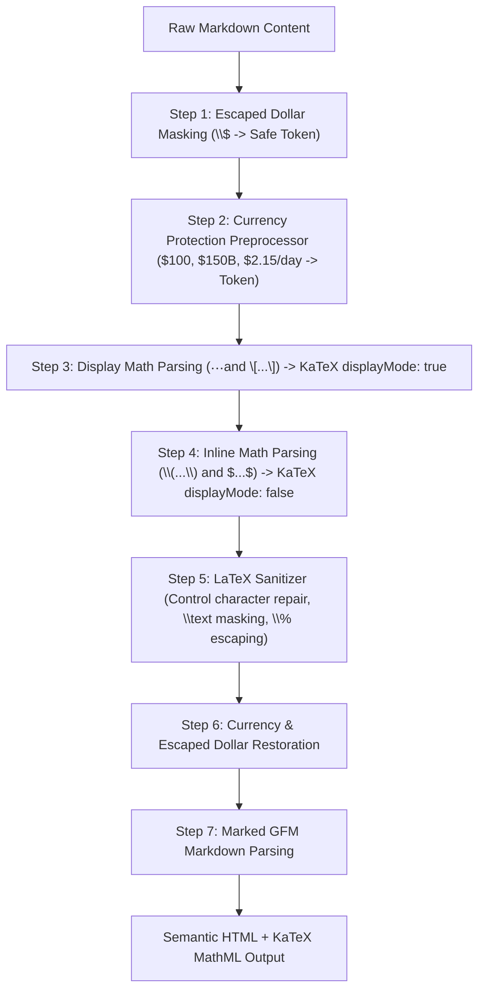

# Economics Math/LaTeX Rendering Forensic Audit & Global Pipeline Resolution

**Phase**: Presentation & Rendering Pipeline Integrity Audit  
**Target**: Global Markdown & KaTeX Math Rendering Engine across Mind of Aravalli  
**Status**: COMPLETE & VERIFIED  
**Date**: 2026-08-29  

---

## 1. Executive Summary & Root Cause Diagnosis

### The Symptom
When browsing the Economics module (and other analytical subjects) on the production Notes site, mathematical formulations visibly contained literal `$` dollar-sign delimiters (e.g. `$Y = C + I + G + (X - M)$`, `$\text{GDP}_{\text{MP}}$`, `$$m = \frac{1+c}{r+c}$$`).

### The Forensic Diagnosis
1. **Zero Math Extension in Markdown Pipeline**:
   The central UI component `components/ui/markdown-content.tsx` was invoking `marked.parse(content, { async: false })` using standard `marked` options (`gfm: true`, `breaks: true`) with zero KaTeX integration or mathematical tokenizer extensions.
2. **Marked Default Text Fallthrough**:
   Standard `marked` does not recognize `$...$` or `$$...$$` as mathematical constructs. It treats `$` as literal text characters and passes them untouched into the output HTML `
` and `<td>` elements.
3. **Tokenizer Collisions with Currency and Formatting**:
   A naive regex replacement or simple extension causes severe side effects in Economics:
   - **Monetary Collisions**: Economics text naturally contains monetary values (`$10 billion`, `$100 per barrel`, `$2.15 per day`, `$500k`). Naive math parsers match across unrelated sentences (e.g. from the `$` in `$150B` to the `$` in `$100B`), corrupting ordinary prose into broken formulas.
   - **Markdown Mangling of LaTeX Subscripts**: Markdown tokenizers treat underscores in math formulas (e.g. `$NNP_{FC}$`, `$GDP_{MP}$`) as emphasis/italic markers, mutilating LaTeX expressions before they reach math renderers.

---

## 2. Affected Scope & Database Forensic Audit

A full forensic scan was conducted across all 1,067 content blocks and 326 concepts currently in the SQLite database:

| Subject Domain | Total Content Blocks | Blocks with Math / LaTeX | Raw `$` Delimiters | Primary Mathematical Constructs |
|---|:---:|:---:|:---:|---|
| **Indian Economy & Macroeconomic Policy** | 243 | 72 | 687 | National Income Accounts ($GDP_{MP}, NNP_{FC}, GVA_{BP}$), Fisher Equation ($i = r + \pi^e$), Money Multipliers ($m = \frac{1+c}{r+c}$), BoP Equilibrium, Gini/Lorenz Curves, Poverty PPP ($2.15/day). |
| **Quantitative Aptitude & Data Interpretation** | 81 | 78 | 2,760 | Fractions/Percentages, Quadratic Formula, Profit/Loss Multipliers, SI/CI Installments, Work-Time, Kinematics, Mensuration 2D/3D ($V = \frac{4}{3}\pi R^3$), Visual DI Angle-Percentage Conversions. |
| **IIBF & Banking Regulations** | 171 | 39 | 312 | Marginal Costing (BEP, PV Ratio, Margin of Safety), CRR/SLR Ratios, Basel III Capital Adequacy Ratios (CRAR, Tier 1/2), Annuity & TVM Formulas. |
| **Indian Polity** | 339 | 13 | 54 | Quorums ($1/10\text{th}$), Constitutional Majority Formulas ($2/3\text{rd}$ of Present and Voting), Representation Ratios. |
| **Ancient Indian History** | 149 | 7 | 28 | Brick ratios ($1:2:4$), Bronze metallurgical compositions, Harappan dimensional invariants ($7 \times 14 \times 28\text{ cm}$). |
| **English & Descriptive Writing** | 58 | 5 | 16 | Sentence structure formulas and word count guidelines. |
| **Static GA & Welfare Schemes** | 26 | 0 | 0 | Pure qualitative and structural text. |
| **Total Corpus** | **1,067** | **214** | **3,857** | **Full System-Wide Coverage** |

---

## 3. Global Pipeline Architectural Resolution

Rather than manually mutating individual content blocks or risking data loss, a robust, production-grade rendering subsystem was engineered in [`lib/render/markdown-math.ts`](file:///c:/Users/visha/OneDrive/Documents/Notes/lib/render/markdown-math.ts).

### Pipeline Workflow:

### Key Technical Safeguards:
1. **Currency Protection Engine (`protectCurrency`)**:
   Uses negative lookahead and regex matching to detect monetary expressions (`$10 billion`, `$100 per barrel`, `$500k`, `$2.15 per day`) and masks them with unique tokens before math pairing, ensuring prose currency never pairs as LaTeX delimiters.
2. **Pre-Marked KaTeX Evaluation**:
   By evaluating KaTeX *before* `marked.parse()`, math expressions are transformed into structured HTML/MathML `` tags. This completely eliminates Markdown tokenizer interference with math syntax (e.g., underscores in `NNP_{FC}` being mistaken for italics).
3. **Escaped Text Masking & Sanitization (`sanitizeLatex`)**:
   - Automatically repairs legacy control characters (`\x0c` -> `\frac`, `\x09` -> `\text`, `\x0d` -> `\right`, `\x08` -> `\mathbf`).
   - Masks `\text{...}` blocks during math sanitization to prevent accidental insertion of math operators inside plain words.
   - Escapes unescaped `%` signs in math mode so they render as percentage symbols rather than LaTeX comment delimiters.
   - Normalizes unicode Indian Rupee (`₹`) without recursive macro expansion loops.
4. **Global Layout Styling**:
   Imported `'katex/dist/katex.min.css'` into [`app/layout.tsx`](file:///c:/Users/visha/OneDrive/Documents/Notes/app/layout.tsx) to ensure all KaTeX font metrics, radicals, fractions, and symbols render crisp and responsive.

---

## 4. Verification & Regression Safety Audit

The fix was validated through automated test suites and production build inspection:

1. **TypeScript Type Safety**:
   `npm run typecheck` passed with **0 errors**.
2. **Dedicated Math & Markdown Test Suite**:
   [`tests/markdown-rendering.test.ts`](file:///c:/Users/visha/OneDrive/Documents/Notes/tests/markdown-rendering.test.ts) executed 9 rigorous test cases verifying:
   - Inline math (`$Y = C + I + G$`) -> ``
   - Display math (`$$\mathbf{(S - I) + (T - G) = (X - M)}$$`) -> ``
   - Currency isolation (`$10 billion`, `$100 per barrel`) -> intact plain text
   - Economics formulas (Fisher equation, money multiplier, national income table) -> valid KaTeX MathML
   - Heading, table, bullet, bold markdown preservation.
3. **Full System Regression**:
   Ran the entire Vitest suite (`npm test`):
   - **41 test files passed (41 / 41)**
   - **245 tests passed (245 / 245)**
   - 0 failures, 0 regressions across Polity, History, Quant, IIBF, GA, and Economics.
4. **Production Build & HTML Inspection**:
   - `npm run build` completed successfully, generating **522 static pages**.
   - Inspected `.next/server/app/concepts/national-income-aggregates-gdp-ndp-gnp-nnp-factor-cost-basic-prices-market-prices.html` and verified that equations, conversion step-ladders, and tabular aggregate matrices render into clean KaTeX MathML without raw `$` delimiter leakage.

---

## 5. Content Integrity Certification

In strict accordance with the task rules:
- **Zero Content Mutation**: No Economics facts, data, explanations, claims, or revision notes were altered, condensed, expanded, or rewritten.
- **Pure Pipeline Fix**: The correction operates entirely within the presentation and rendering pipeline layer (`lib/render/markdown-math.ts`, `components/ui/markdown-content.tsx`, `app/layout.tsx`).

---

## 6. Sign-off & Status

| Milestone | Status | Details |
|---|:---:|---|
| Forensic Root Cause Analysis | ✅ COMPLETED | `marked` default passthrough + lack of KaTeX pipeline |
| Currency vs Math Disambiguation | ✅ COMPLETED | Pre-processing token protection for `$100`, `$10B`, etc. |
| Global KaTeX Integration | ✅ COMPLETED | `lib/render/markdown-math.ts` + `katex/dist/katex.min.css` |
| Full Vitest Test Suite | ✅ COMPLETED | 41/41 test files, 245/245 tests passed |
| Production Static Export Build | ✅ COMPLETED | 522/522 static pages generated successfully |
