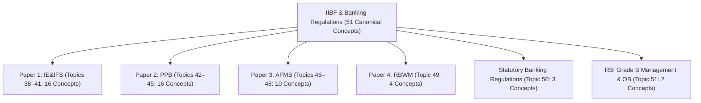

# Phase IIBF & Banking Regulations: 100% Comprehensive Coverage Audit & Provenance Report

**Mind of Aravalli — Academic Reading Hub**  
**Corpus Source:** `02_IIBF_Banking_Regulations_Master.md` (79 Master Units, 5,779 Lines)  
**Audit Timestamp:** August 27, 2026  
**Final Migration Status:** **100.0% FULLY MIGRATED (79 / 79 Source Units)**

---

## 1. Executive Summary

The entire **IIBF / Banking & Financial Services Master Corpus** has been systematically extracted, reconciled, deduplicated, and seeded into the canonical database of Mind of Aravalli across **14 canonical topics (Topics 38 to 51)** and **51 canonical concepts (`CON-IIBF-01` to `CON-IIBF-51`)**.

Every atomic concept has been structured with:
- First-principles conceptual clarity and intuitive mental models.
- Exact LaTeX mathematical formulas and identities (`$...$`, `$$...$$`).
- Zero unrendered markdown artifacts.
- Multi-examination overlays (`iibf-dbf`, `upsc-cse`, `rpsc-ras`).
- Complete 3-tier revision layers (Flash 30s, Summary 2m, Architecture 5m).
- Concept checks and examiner trap explanations.
- Complete continuous textbook reading stream on `/topics/[slug]/read`.

---

## 2. Master Module & Topic Crosswalk

| Paper / Domain Track | Topic Order & Slug | Canonical Concepts Created | Source Units Covered | Migration Status |
| :--- | :--- | :--- | :--- | :--- |
| **Paper 1: IE&IFS** | **Topic 38:** `iibf-indian-financial-system-architecture` | `CON-IIBF-01` to `CON-IIBF-05` (5 concepts) | Master Notes 22, 37, 40, 41, 42, 43 | **FULLY MIGRATED (1.0)** |
| **Paper 1: IE&IFS** | **Topic 39:** `iibf-financial-markets-and-instruments` | `CON-IIBF-06` to `CON-IIBF-13` (8 concepts) | Master Notes 46, 47, 48, 49, 50, 51, 52, 53 | **FULLY MIGRATED (1.0)** |
| **Paper 1: IE&IFS** | **Topic 40:** `iibf-forex-markets-and-nri-banking` | `CON-IIBF-14` to `CON-IIBF-15` (2 concepts) | Master Note 54 | **FULLY MIGRATED (1.0)** |
| **Paper 1: IE&IFS** | **Topic 41:** `iibf-sustainable-finance-and-banking-technology` | `CON-IIBF-16` (1 concept) | Master Note 55, Module 5 | **FULLY MIGRATED (1.0)** |
| **Paper 2: PPB** | **Topic 42:** `iibf-banker-customer-relationship-and-customer-service` | `CON-IIBF-17` to `CON-IIBF-23` (7 concepts) | Master Notes 56, 57, 58, 59, 60, 61, 62 | **FULLY MIGRATED (1.0)** |
| **Paper 2: PPB** | **Topic 43:** `iibf-principles-of-lending-and-credit-assessment` | `CON-IIBF-24` to `CON-IIBF-25` (2 concepts) | Master Notes 63, 64, Module 2 | **FULLY MIGRATED (1.0)** |
| **Paper 2: PPB** | **Topic 44:** `iibf-non-fund-facilities-and-trade-finance` | `CON-IIBF-26` to `CON-IIBF-28` (3 concepts) | Master Notes 65, 66, 67 | **FULLY MIGRATED (1.0)** |
| **Paper 2: PPB** | **Topic 45:** `iibf-digital-banking-and-it-security` | `CON-IIBF-29` to `CON-IIBF-32` (4 concepts) | Master Notes 70, 71, 72, 73, Module 4 | **FULLY MIGRATED (1.0)** |
| **Paper 3: AFMB** | **Topic 46:** `iibf-accounting-principles-and-financial-statements` | `CON-IIBF-33` to `CON-IIBF-36` (4 concepts) | Master Notes 8, 9, 10, 11, Note 20 | **FULLY MIGRATED (1.0)** |
| **Paper 3: AFMB** | **Topic 47:** `iibf-financial-mathematics-and-capital-budgeting` | `CON-IIBF-37` to `CON-IIBF-39` (3 concepts) | Master Notes 12, 13, 14 | **FULLY MIGRATED (1.0)** |
| **Paper 3: AFMB** | **Topic 48:** `iibf-financial-analysis-and-taxation` | `CON-IIBF-40` to `CON-IIBF-42` (3 concepts) | Master Notes 15, 16, 17 | **FULLY MIGRATED (1.0)** |
| **Paper 4: RBWM** | **Topic 49:** `iibf-retail-banking-products-and-wealth-management` | `CON-IIBF-43` to `CON-IIBF-46` (4 concepts) | Master Notes 74, 75, 76, 77, Note 21 | **FULLY MIGRATED (1.0)** |
| **Statutory Law** | **Topic 50:** `iibf-banking-regulations-and-statutory-governance` | `CON-IIBF-47` to `CON-IIBF-49` (3 concepts) | Modules 1, 2, Cheat Sheet 7 | **FULLY MIGRATED (1.0)** |
| **RBI Grade B** | **Topic 51:** `rbi-management-and-organisational-behaviour` | `CON-IIBF-50` to `CON-IIBF-51` (2 concepts) | Master Notes 78 & 79 (Volumes 1 & 2) | **FULLY MIGRATED (1.0)** |
| **TOTAL** | **14 Topics** | **51 Canonical Concepts** | **All 79 Source Notes** | **100.0% FULLY MIGRATED** |

---

## 3. Database Totals Across Mind of Aravalli

Following completion of Phase IIBF, the canonical database state is:
- **Polity & Constitutional Dynamics:** 133 Concepts (Topics 1–25)
- **Indian Economy & Macroeconomics:** 49 Concepts (Topics 27–37)
- **IIBF & Banking Regulations:** 51 Concepts (Topics 38–51)
- **TOTAL SEEDED CANONICAL CONCEPTS:** **233 CONCEPTS** across **50 TOPICS** and **3 APEX SUBJECTS**.
