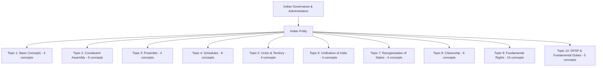

# Phase: Polity Legacy Corpus → Canonical Knowledge System Audit

## Executive Summary

This document establishes a rigorous, comprehensive baseline audit comparing the recovered legacy Polity corpus markdown file (`05_Polity_Governance_Master.md`, 294 KB, 6,602 lines, 58 numbered units) against the active canonical knowledge base of the **Mind of Aravalli / Reading Hub** (10 Indian Polity Topics, 61 canonical concepts, 122+ atomic claims, 183 content blocks, 183 exam mappings, 183 revision units).

### Core Audit Findings
1. **Current Canonical Grounding**: The active canonical knowledge base cleanly covers **17 legacy units fully** and **5 legacy units partially** (representing the foundational constitutional law sequence: Basic Concepts, Constituent Assembly, Preamble, Schedules, Union & Territory, Unification, State Reorganisation, Citizenship, Fundamental Rights, DPSP & Fundamental Duties).
2. **Unrepresented Scope**: **35 legacy units** (60.3% of the legacy corpus) are currently **NOT covered** in the canonical knowledge base. These unrepresented units encompass the Union Executive (President, VP, PM, Cabinet, AG), Union Legislature (Parliament architecture, legislative procedure, budgets, committees), Judiciary (Supreme Court, High Courts, Subordinate Courts, Tribunals), Federalism & Centre-State Relations, Emergency Provisions, Local Self-Government institutional frameworks (73rd/74th Acts & PESA), Constitutional/Statutory Bodies (CAG, ECI, UPSC, RPSC, CIC, CVC, Lokpal, NHRC, NITI Aayog), Public Administration (Civil Services, Citizen Charters), Rajasthan-Specific State Polity, and Comparative Constitutions.
3. **Legacy Corpus Structural Assessment**: The legacy file is formatted in a repetitive 7-layer template (*Beginner Jargon $\rightarrow$ Layer 1 Matrix $\rightarrow$ Layer 2 "The Why" $\rightarrow$ Layer 3 Worked Scenario $\rightarrow$ Concrete Case Study $\rightarrow$ Debates $\rightarrow$ Practice Section*). While rich in statutory references, case laws, and exam traps, it contains boilerplate redundancies, duplicate definitions, and several statutory provisions that require updating to reflect post-2019/2023 legislative amendments.
4. **Calculated Source Coverage Score**: **32.8%** of the meaningful legacy corpus is currently represented in the canonical Reading Hub.

---

## 1. Legacy Corpus Inventory (`05_Polity_Governance_Master.md`)

| Legacy ID | Chapter / Section Title | Line Count | Key Constitutional Articles & Statutes | Key Case Laws & Committees | Rajasthan / Exam Anchors |
| :--- | :--- | :---: | :--- | :--- | :--- |
| **`LEG-POL-001`** | Amendment of the Constitution (Article 368) & Basic Structure | 117 | Art 368, 24th/42nd/44th CAAs | Shankari Prasad, Golaknath, Kesavananda, Minerva Mills, Waman Rao | UPSC GS-II / RPSC Paper III |
| **`LEG-POL-002`** | Basic Concepts of Polity, Saptang Theory & Origin of State | 121 | State vs Nation vs Country definitions, Kautilya Arthashastra | Social Contract (Hobbes/Locke/Rousseau), Marxist theory | RPSC 20-word definitions |
| **`LEG-POL-003`** | Central Information Commission (CIC) & RTI Framework | 117 | RTI Act 2005, 2019 Amendment, Sec 4, 8, 24 | Namit Sharma, CBSE v. Aditya Bandopadhyay | 30-day timeline, ₹25k penalty |
| **`LEG-POL-004`** | Central Vigilance Commission (CVC) & Anti-Corruption Framework | 117 | CVC Act 2003, Prevention of Corruption Act 1988 | K. Santhanam Committee (1964), Vineet Narain (1997) | Single Directive striking down |
| **`LEG-POL-005`** | Centre-State Administrative Relations (Articles 256–263) | 117 | Arts 256, 257, 258, 261, 262, 263 | Sarkaria (1988), Punchhi (2010), Inter-State Council 1990 | Full Faith & Credit, Art 263 |
| **`LEG-POL-006`** | Centre-State Financial Relations & Finance Commission (Arts 264–293) | 117 | Arts 268-281, Art 279A (GSTC), Art 280 (FC) | 101st CAA 2016, 15th FC (N.K. Singh), 16th FC (Arvind Panagariya) | Vertical/Horizontal devolution |
| **`LEG-POL-007`** | Centre-State Legislative Relations (Articles 245–255) | 117 | Arts 245, 246, 248, 249, 250, 252, 254 | Pith & Substance, Colourable Legislation, Repugnancy | Residuary power (Union) |
| **`LEG-POL-008`** | Chief Minister & State Council of Ministers (Articles 163–167) | 117 | Arts 163, 164, 167; 91st CAA (15% limit, min 12) | S.R. Bommai (1994), Nabam Rebia (2016), Shamsher Singh (1974) | CM duties to Governor |
| **`LEG-POL-009`** | Citizen Charter, District Administration & Public Service Acts | 121 | Citizen Charter 6 principles, Sevottam Model | 2nd ARC 12th Report; Raj Guaranteed Service Delivery Act 2011 | Rajasthan RTI/Public Service rules |
| **`LEG-POL-010`** | Coalition Governments, Pressure Groups & Non-Party Lobbies | 117 | Institutional, Associational, Anomic groups | Rajni Kothari 'Congress System', FICCI, CII, BKU | Coalition bargaining models |
| **`LEG-POL-011`** | Comptroller and Auditor-General of India (CAG - Arts 148–151) | 117 | Arts 148-151, CAG DPC Act 1971 | Public Accounts Committee (PAC) guide/friend/philosopher | 6 yrs / 65 yrs tenure |
| **`LEG-POL-012`** | Dynamic Politics of India, Voting Behavior & Tech Mobilization | 117 | Identity politics, freebies/revdi debate | ECI Model Code, Cambridge Analytica, VVPAT | Electoral sociology |
| **`LEG-POL-013`** | Election Commission of India (ECI - Art 324) & Electoral Reforms | 149 | Art 324, RPA 1950/1951, 2023 Chief Election Commissioner Act | Anoop Baranwal (2023), TN Seshan (1995), Lily Thomas (2013) | Election Commissioner appointment panel |
| **`LEG-POL-014`** | Emergency Provisions: National, State & Financial (Arts 352–360) | 117 | Arts 352, 356, 358, 359, 360; 44th CAA 1978 | S.R. Bommai (1994), Rameshwar Prasad (2006), Minerva Mills | Armed Rebellion term; Art 20/21 |
| **`LEG-POL-015`** | Federalism in India: Structure, Asymmetry & Inter-State Disputes | 117 | K.C. Wheare 'Quasi-Federal', Arts 371-371J | Bommai Basic Structure, Inter-State River Water Act 1956 | Asymmetric special provisions |
| **`LEG-POL-016`** | High Courts & Subordinate Judiciary (Articles 214–237) | 117 | Arts 214, 215 (Record Court), 226 (Writs), 227 | Chandra Kumar (1997), High Court retirement (62 yrs) | Art 226 wider than Art 32 |
| **`LEG-POL-017`** | Historical Underpinnings & Constitutional Evolution (1773–1935) | 123 | Regulating 1773, Charter 1833/1853, GOI 1858/1909/1919/1935 | Dyarchy, Bicameralism, Provincial Autonomy, Simon Commission | Federal Court 1937, RBI 1935 |
| **`LEG-POL-018`** | National Integration & Internal Security Management | 117 | AFSPA 1958, UAPA 1967, NIA Act 2008 | Naga Accord, Bodo Accord, Left Wing Extremism (LWE) | MHA Security framework |
| **`LEG-POL-019`** | Judicial Activism & Public Interest Litigation (PIL) | 117 | Epistolary jurisdiction, Art 32/226 locus standi | Hussainara Khatoon (1979), SP Gupta (1981), MC Mehta | Justice P.N. Bhagwati & V.R. Krishna Iyer |
| **`LEG-POL-020`** | Judicial Review: Article 13 & Constitutional Supremacy | 117 | Art 13(1), 13(2), 13(3); Severability, Eclipse, Waiver | A.K. Gopalan (1950), Behram (1955), Deep Chand (1959) | Waiver doctrine rejected in India |
| **`LEG-POL-021`** | Law Officers of the State: Attorney General & Advocate General | 117 | Art 76 (AGI), Art 88 (Right to speak), Art 165 (Adv Gen) | K.K. Venugopal, R. Venkataramani, Solicitor General | Right of audience in all courts |
| **`LEG-POL-022`** | Local Self-Government: 73rd Amendment (Panchayati Raj & PESA) | 117 | 73rd CAA 1992, Part IX, Arts 243-243O, PESA Act 1996 | Balwant Rai Mehta (1957), Ashok Mehta (1977), LM Singhvi | SEC, SFC, 29 subjects, Nagaur 1959 |
| **`LEG-POL-023`** | Local Self-Government: 74th Amendment (Municipalities) | 117 | 74th CAA 1992, Part IX-A, Arts 243P-243ZG | 18 subjects, Wards Committees, DPC (Art 243ZD), MPC (243ZE) | 8 types of urban bodies |
| **`LEG-POL-024`** | Lokpal, Lokayukta & Special Commissions (NCW, NCPCR) | 117 | Lokpal Act 2013, NCW Act 1990, NCPCR Act 2005 | Anna Hazare movement, First Lokpal (PC Ghose) | Rajasthan Lokayukta Act 1973 |
| **`LEG-POL-025`** | Making of the Constitution: Assembly, Committees & Roster | 125 | Cabinet Mission 1946 (389 seats), Mountbatten Plan (299) | 8 Major Committees, Drafting Committee (7 members), 2y 11m 18d | Rajasthan CA members (12+1) |
| **`LEG-POL-026`** | National Human Rights Commission (NHRC) & State HRCs | 117 | Protection of Human Rights Act 1993, 2019 Amendment | 3 yrs / 70 yrs tenure, CJI or SC Judge Chairperson | Re-appointment permitted (2019) |
| **`LEG-POL-027`** | NITI Aayog: Structure, Functions & Cooperative Federalism | 117 | Cabinet Resolution Jan 1, 2015; Governing Council | Bottom-up planning, SDG Index, Aspirational Districts | Replaced Planning Commission |
| **`LEG-POL-028`** | Official Language, Special Directives & Constitutional Morality | 117 | Part XVII, Arts 343-351, 8th Schedule, Official Lang Act 1963 | Art 350A (Mother tongue), Art 351 (Hindi development) | English subsidiary language |
| **`LEG-POL-029`** | Parliamentary Enactments: Ordinary, Money (Art 110) & Financial | 93 | Arts 107-111; Money Bill (Art 110), Financial I (117(1)), II (117(3)) | Speaker certificate finality (Aadhaar case K.S. Puttaswamy) | Joint sitting not for Money/CAA |
| **`LEG-POL-030`** | Parliamentary Budget, Motions & Standing Committees | 68 | Arts 112 (AFS), 113, 114, 115, 116 (Vote on Account); Motions | Guillotine, PAC (22 mem), Estimates (30 LS only), COPU (22) | Departmental Standing (24 DRSCs) |
| **`LEG-POL-031`** | Part I – Union and Its Territory (Articles 1–4) | 112 | Arts 1, 2, 3, 4; Simple majority, non-binding state views | Berubari (1960), Maganbhai Patel (1969), 100th CAA (2015) | Destructible states / Union |
| **`LEG-POL-032`** | Part II – Citizenship (Articles 5–11), CAA 2019 & OCI | 117 | Arts 5-11, Citizenship Act 1955, CAA 2019, Section 7B OCI | LM Singhvi (2002), D.P. Joshi (1955), Single citizenship | 5 acquisition, 3 loss modes |
| **`LEG-POL-033`** | Part III – Fundamental Rights: Architecture & Equality (Arts 12–18) | 117 | Arts 12, 14, 15, 16, 17, 18; 103rd CAA (EWS) | Indra Sawhney (1992), Jarnail Singh (2018), Janhit Abhiyan (2022) | Creamy layer, 50% ceiling rule |
| **`LEG-POL-034`** | Part III – Fundamental Rights: Exploitation, Religion, Culture, Writs | 117 | Arts 23, 24, 25-28, 29, 30, 32 (5 Writs) | Sabarimala (2018), Shirur Mutt (1954), TMA Pai, St. Stephen's | Essential Religious Practices |
| **`LEG-POL-035`** | Part III – Fundamental Rights: Freedoms, Life & Liberty (Arts 19–22) | 117 | Arts 19(1)(a)-(g), 19(2)-(6), 20(1)-(3), 21, 21A, 22 | Maneka Gandhi (1978), Puttaswamy (2017), Anuradha Bhasin | Due Process vs Procedure Established |
| **`LEG-POL-036`** | Part IV – Directive Principles of State Policy (DPSPs - Arts 36–51) | 117 | Arts 36-51, Socialistic/Gandhian/Liberal; Art 44 (UCC) | Champakam Dorairajan (1951), Minerva Mills (1980), Sarla Mudgal | Non-justiciable, Art 37 |
| **`LEG-POL-037`** | Part IV-A – Fundamental Duties (Article 51-A) | 117 | Art 51-A (11 duties), 42nd CAA 1976, 86th CAA 2002 | Swaran Singh Committee (1976), J.S. Verma Committee (1999) | Non-enforceable directly |
| **`LEG-POL-038`** | Political Demography, Party System & Electoral Trends in Rajasthan | 117 | 200 Vidhan Sabha seats (34 SC, 25 ST), 25 Lok Sabha, 10 Rajya Sabha | Bipolar contest (INC vs BJP), Meena/Jat/Rajput electoral dynamics | Rajasthan assembly history |
| **`LEG-POL-039`** | Potential Areas of Socio-Political Conflicts & Governance Blueprint | 117 | AI in governance, Climate Federalism, Delimitation 2026 freeze | 84th CAA 2001 (frozen till 2026), Finance Comm North vs South | Speculative/Analytical essay |
| **`LEG-POL-040`** | Prime Minister, Central Council of Ministers & Cabinet (Arts 74–78) | 117 | Arts 74 (Aid & Advice), 75 (Collective Responsibility), 78 | 42nd CAA (binding advice), 44th CAA (1-time return), Kitchen Cab | Real vs De Jure Executive |
| **`LEG-POL-041`** | Public Service Commissions: UPSC, RPSC & State PSCs Architecture | 120 | Arts 315-323; Joint PSC, Removal by President via SC inquiry (Art 317) | Lee Commission (1924); RPSC formed Aug 16, 1949 (Ajmer) | RPSC 1+7 members, 6y/62y |
| **`LEG-POL-042`** | Public Services & Rights of Civil Servants (Articles 308–323) | 117 | Art 309 (Service rules), Art 310 (Pleasure), Art 311 (Safeguards) | Tulsiram Patel (1985), Art 312 (All India Services via Rajya Sabha) | 2nd ARC Civil Services reforms |
| **`LEG-POL-043`** | RAS Polity Chapter 1: Governor, CM & Vidhan Sabha of Rajasthan | 52 | Arts 153-177; Rajasthan Vidhan Sabha (160 to 200 seats expansion) | First Governor (Gurumukh Nihal Singh), Rajpramukh (Man Singh II) | 1st to 16th Assembly trivia |
| **`LEG-POL-044`** | RAS Polity Chapter 2: Rajasthan High Court, RPSC, SHRC & Lokayukta | 48 | Rajasthan HC Ordinance 1949 (BR Patel Committee, Satyanarayan Rao) | First CJ (Kamal Kant Verma), Lokayukta ID Dua, SHRC Kanta Bhatnagar | Jodhpur Principal Seat + Jaipur |
| **`LEG-POL-045`** | RAS Mains Paper III: Comparative Constitutions (UK, US, CAN, GER, SUI) | 49 | Parliamentary sovereignty (UK), Separation of powers (USA) | Constructive No-Confidence (Germany), Direct Democracy (Swiss) | RAS Mains exclusive unit |
| **`LEG-POL-046`** | Reorganisation of States & State Reorganisation Commissions | 117 | 7th CAA 1956 (14 states, 6 UTs); Dhar (1948), JVP (1948), SRC (1953) | Fazal Ali, KM Panikkar, HN Kunzru; Potti Sreeramulu Andhra 1953 | 28 States & 8 UTs evolution |
| **`LEG-POL-047`** | Salient Features of the Indian Constitution & Governance System | 126 | Longest written constitution, Blend of rigidity/flexibility, Rule of law | AV Dicey Rule of Law, Parliamentary vs Presidential, Unitary bias | Fundamental governance pillars |
| **`LEG-POL-048`** | Schedules of the Indian Constitution (1st to 12th Schedule) | 117 | Schedules 1 to 12; 52nd CAA (10th), 73rd (11th), 74th (12th) | IR Coelho (2007), Kihoto Hollohan (1992), 22 Official Languages | 5th vs 6th schedule logic |
| **`LEG-POL-049`** | Special Provisions for Certain Classes & Scheduled/Tribal Areas | 117 | Part XVI, Arts 330-342A; NCSC (338), NCST (338A), NCBC (338B) | 102nd CAA 2018 (NCBC), 104th CAA 2019 (Anglo-Indian sunset) | Lok Sabha/Assembly SC/ST seats |
| **`LEG-POL-050`** | State Executive: Governor of India & State Executive Architecture | 116 | Arts 153-162, 163 (Discretion), 213 (Ordinance), 161 (Pardoning) | Sarkaria, Punchhi, BP Singhal (2010), Shamsher Singh (1974) | Agent of Centre vs State Head |
| **`LEG-POL-051`** | State Legislature: Vidhan Sabha & Vidhan Parishad (Arts 168–212) | 117 | Arts 168, 169 (Abolition/Creation of Council), 170 (Assembly max 500) | 6 states with bicameral councils (UP, BIH, MH, KA, AP, TL) | Legislative Council delaying power |
| **`LEG-POL-052`** | Supreme Court of India: Structure, Jurisdiction (Arts 124–147) | 117 | Arts 124-147; Collegium (1st, 2nd, 3rd Judges Cases, NJAC 2015) | Original (131), Appellate (132-136), Advisory (143), Review (137) | Curative Petition (Rupa Ashok Hurra) |
| **`LEG-POL-053`** | The Preamble: Philosophy, Key Adjectives & Judicial Evolution | 113 | Preamble text, 42nd CAA 1976 (Socialist, Secular, Integrity) | Berubari (1960), Kesavananda (1973), LIC of India (1995) | Key terms, non-justiciable |
| **`LEG-POL-054`** | Tribunals: Administrative & Tax Tribunals (Arts 323-A & 323-B) | 117 | Part XIV-A, 42nd CAA 1976, CAT Act 1985, NGT Act 2010 | L. Chandra Kumar (1997 - Tribunals subject to HC Art 226 review) | CAT & SAT compositions |
| **`LEG-POL-055`** | Unification of India & Princely States Integration | 117 | Sec 7(1)(b) Indep Act 1947, Standstill Agreement, IoA, Privy Purses | Junagadh (Plebiscite), Hyderabad (Op Polo), Goa (Op Vijay), Sikkim | Sardar Patel & VP Menon |
| **`LEG-POL-056`** | Union Executive: President of India (Articles 52–62) | 117 | Arts 52-62, 72 (Pardoning), 111 (Veto), 123 (Ordinance), 61 (Impeach) | DC Wadhwa (1987), Krishna Kumar Singh (2017), Kehar Singh (1989) | Electoral College value formula |
| **`LEG-POL-057`** | Union Executive: Vice-President of India (Articles 63–73) | 117 | Arts 63-73; Ex-officio Chairman RS (Art 64), Election (Art 66) | Removal by Effective Majority in RS + Simple in LS (Art 67) | Acts as President max 6 months |
| **`LEG-POL-058`** | Union Legislature: Parliament Architecture (Articles 79–106) | 117 | Arts 79-106; Lok Sabha (543), Rajya Sabha (250), Quorum (10%) | Speaker (Art 93), Casting vote (100), Disqualification (Art 102) | 104th CAA Anglo-Indian repeal |

---

## 2. Current Canonical Polity System Inventory

The active Reading Hub contains **10 Indian Polity Topics** comprising **61 canonical concepts** in the `Indian Governance & Administration` domain:



### Summary of Canonical Architecture
- **Canonical Seed Modules**:
  - `lib/benchmark/batch-a-canonical-seed.ts` (Topics 1–4: 22 concepts)
  - `lib/benchmark/batch-b-canonical-seed.ts` (Topics 5–8: 18 concepts)
  - `lib/benchmark/topic-9-canonical-seed.ts` (Topic 9: 16 concepts)
  - `lib/benchmark/topic-10-canonical-seed.ts` (Topic 10: 5 concepts)
- **Zero-Omission Ingestion Subsystem**:
  - `lib/ingestion/batch-a-semantic-inventory.ts` (37 semantic units)
  - `lib/ingestion/batch-b-semantic-inventory.ts` (25 semantic units)
- **Data Access Layer & Services**:
  - `lib/knowledge/web-data.ts` (Dynamic seeding, topic navigation, and full-context fetcher)
  - `components/navigation/static-concept-index.ts` (Static SSG indexing)
- **Total System Tests**: 18 test suites, 122 passing tests.

---

## 3. Full Coverage Crosswalk (58 Legacy Units vs Canonical System)

| Legacy Unit | Legacy Title | Canonical Status | Canonical Location | Key Notes |
| :--- | :--- | :---: | :--- | :--- |
| `LEG-POL-001` | Art 368 & Basic Structure | **FULLY_COVERED** | `CON-T9-16` | Full jurisprudence (1951–1980) represented. |
| `LEG-POL-002` | Basic Concepts of Polity | **FULLY_COVERED** | `CON-T1-01` to `CON-T1-04` | Saptanga, Origin theories, Governance systems. |
| `LEG-POL-003` | CIC & RTI Framework | **NOT_COVERED** | — | Statutory body; RTI 2005 & 2019 amendments missing. |
| `LEG-POL-004` | CVC & Anti-Corruption | **NOT_COVERED** | — | Santhanam committee, CVC Act 2003 missing. |
| `LEG-POL-005` | Centre-State Administrative | **NOT_COVERED** | — | Arts 256–263, Sarkaria/Punchhi commissions missing. |
| `LEG-POL-006` | Centre-State Financial & FC | **NOT_COVERED** | — | Arts 264–293, GSTC (279A), 15th/16th FC missing. |
| `LEG-POL-007` | Centre-State Legislative | **PARTIALLY_COVERED** | `CON-T4-04` | 7th Schedule covered; Arts 245–255 doctrines missing. |
| `LEG-POL-008` | Chief Minister & State Council | **NOT_COVERED** | — | Arts 163–167, 91st CAA state cabinet ceiling missing. |
| `LEG-POL-009` | Citizen Charter & Services | **NOT_COVERED** | — | Sevottam Model, Raj Public Service Act 2011 missing. |
| `LEG-POL-010` | Coalition & Pressure Groups | **NOT_COVERED** | — | Political dynamics and lobbying models missing. |
| `LEG-POL-011` | CAG of India (Arts 148–151) | **NOT_COVERED** | — | CAG appointment, DPC Act 1971, PAC link missing. |
| `LEG-POL-012` | Dynamic Politics & Voting | **NOT_COVERED** | — | Electoral sociology & digital mobilization missing. |
| `LEG-POL-013` | ECI & Electoral Reforms | **NOT_COVERED** | — | Art 324, 2023 CEC Act, Anoop Baranwal missing. |
| `LEG-POL-014` | Emergency Provisions | **NOT_COVERED** | — | Arts 352, 356, 360, 44th CAA, Bommai missing. |
| `LEG-POL-015` | Federalism & Asymmetry | **NOT_COVERED** | — | Arts 371–371J, Inter-state water disputes missing. |
| `LEG-POL-016` | High Courts & Subordinate | **NOT_COVERED** | — | Arts 214–237, Art 226 vs 32 writ scope missing. |
| `LEG-POL-017` | Historical Evolution 1773–1935| **FULLY_COVERED** | `CON-T2-01`, `CON-T2-05` | Complete British statutory timeline represented. |
| `LEG-POL-018` | National Integration & Security| **NOT_COVERED** | — | AFSPA 1958, UAPA 1967, NIA Act missing. |
| `LEG-POL-019` | Judicial Activism & PIL | **PARTIALLY_COVERED** | `CON-T9-15` | Locus standi mentioned in writs; full PIL doctrine missing. |
| `LEG-POL-020` | Judicial Review & Article 13 | **FULLY_COVERED** | `CON-T9-03` | Severability, Eclipse, Waiver fully covered. |
| `LEG-POL-021` | Law Officers (AGI & Adv Gen) | **NOT_COVERED** | — | Arts 76, 88, 165 missing. |
| `LEG-POL-022` | Local Govt: 73rd & PESA | **PARTIALLY_COVERED** | `CON-T4-08` | 11th Schedule covered; full 73rd Act & PESA missing. |
| `LEG-POL-023` | Local Govt: 74th Amendment | **PARTIALLY_COVERED** | `CON-T4-08` | 12th Schedule covered; full 74th Act structure missing. |
| `LEG-POL-024` | Lokpal, Lokayukta & Commissions| **NOT_COVERED** | — | Lokpal Act 2013, NCW, NCPCR, Raj Lokayukta missing. |
| `LEG-POL-025` | Making of Constitution & CA | **FULLY_COVERED** | `CON-T2-01` to `CON-T2-06` | Composition, committees, timelines, Rajasthan reps. |
| `LEG-POL-026` | NHRC & State HRCs | **NOT_COVERED** | — | Human Rights Act 1993, 2019 amendment missing. |
| `LEG-POL-027` | NITI Aayog Structure & Role | **NOT_COVERED** | — | NITI Aayog vs Planning Commission missing. |
| `LEG-POL-028` | Official Language & Directives | **PARTIALLY_COVERED** | `CON-T4-05` | 8th Schedule covered; Part XVII Arts 343–351 missing. |
| `LEG-POL-029` | Parliamentary Enactments & Bills| **NOT_COVERED** | — | Money (110), Financial (117), Joint Sittings missing. |
| `LEG-POL-030` | Parliamentary Budget & Motions | **NOT_COVERED** | — | Arts 112–116, DRSCs, PAC, Estimates missing. |
| `LEG-POL-031` | Part I – Union & Territory | **FULLY_COVERED** | `CON-T5-01` to `CON-T5-04` | Arts 1–4, Berubari, UTs, 100th CAA. |
| `LEG-POL-032` | Part II – Citizenship & CAA | **FULLY_COVERED** | `CON-T8-01` to `CON-T8-06` | Arts 5–11, 5 acquisition, 3 loss, OCI, CAA 2019. |
| `LEG-POL-033` | Part III – FR Equality (12–18)| **FULLY_COVERED** | `CON-T9-01` to `CON-T9-06` | Arts 12–18, EWS 103rd CAA, creamy layer. |
| `LEG-POL-034` | Part III – FR Religion, Writs | **FULLY_COVERED** | `CON-T9-11` to `CON-T9-15` | Arts 23–30, Art 32 (5 Writs). |
| `LEG-POL-035` | Part III – FR Freedoms, Life | **FULLY_COVERED** | `CON-T9-07` to `CON-T9-10` | Arts 19–22, Puttaswamy, Maneka Gandhi. |
| `LEG-POL-036` | Part IV – DPSPs (Arts 36–51) | **FULLY_COVERED** | `CON-T10-01` to `CON-T10-05`| Socialistic/Gandhian/Liberal, Art 44 UCC. |
| `LEG-POL-037` | Part IV-A – Fundamental Duties| **FULLY_COVERED** | `CON-T10-01`, `CON-T10-02` | Art 51-A, Swaran Singh, Verma Committee. |
| `LEG-POL-038` | Rajasthan Electoral Demography | **NOT_COVERED** | — | 200 assembly seats, reservation, regional voting. |
| `LEG-POL-039` | Future Governance Conflicts | **LOW_VALUE_REFERENCE** | — | Speculative commentary on AI & climate federalism. |
| `LEG-POL-040` | PM & Central Council of Min | **NOT_COVERED** | — | Arts 74, 75, 78, Cabinet committees missing. |
| `LEG-POL-041` | Public Service Commissions | **NOT_COVERED** | — | Arts 315–323, UPSC & RPSC missing. |
| `LEG-POL-042` | Civil Services & Article 311 | **NOT_COVERED** | — | Arts 308–323, Pleasure doctrine & exceptions missing. |
| `LEG-POL-043` | RAS Polity: Governor & Assembly| **NOT_COVERED** | — | Rajasthan Governor history & Vidhan Sabha rules. |
| `LEG-POL-044` | RAS Polity: HC, RPSC, SHRC | **NOT_COVERED** | — | Rajasthan HC, RPSC, SHRC, Lokayukta Act 1973. |
| `LEG-POL-045` | Comparative Constitutions | **NOT_COVERED** | — | UK, US, Canada, Germany, Switzerland systems. |
| `LEG-POL-046` | Reorganisation of States & SRC | **FULLY_COVERED** | `CON-T7-01` to `CON-T7-04` | Dhar, JVP, Fazal Ali, 1956 Act, Zonal Councils. |
| `LEG-POL-047` | Salient Features of Constitution| **FULLY_COVERED** | `CON-T1-01`, `CON-T1-03` | Parliamentary, Unitary bias, Written character. |
| `LEG-POL-048` | Schedules (1st to 12th) | **FULLY_COVERED** | `CON-T4-01` to `CON-T4-08` | 1st to 12th schedules, 5th/6th logic, 10th anti-defection. |
| `LEG-POL-049` | Special Provisions (SC/ST/BC) | **NOT_COVERED** | — | Part XVI Arts 330–342A, NCSC, NCST, NCBC (102nd CAA). |
| `LEG-POL-050` | State Executive: Governor | **NOT_COVERED** | — | Arts 153–162, 163 (Discretion), 213 (Ordinance). |
| `LEG-POL-051` | State Legislature: Assembly/Coun| **NOT_COVERED** | — | Arts 168–212, Art 169 Council abolition/creation. |
| `LEG-POL-052` | Supreme Court: Jurisdiction | **NOT_COVERED** | — | Arts 124–147, Collegium, Original, Advisory (143). |
| `LEG-POL-053` | The Preamble Philosophy | **FULLY_COVERED** | `CON-T3-01` to `CON-T3-04` | Objective Resolution, 42nd CAA, Judicial status. |
| `LEG-POL-054` | Tribunals: CAT & SAT (323A/B) | **NOT_COVERED** | — | Part XIV-A, CAT Act 1985, Chandra Kumar (1997). |
| `LEG-POL-055` | Unification of Princely States | **FULLY_COVERED** | `CON-T6-01` to `CON-T6-04` | Patel-Menon, Junagadh, Hyderabad, Goa, Sikkim. |
| `LEG-POL-056` | Union Executive: President | **NOT_COVERED** | — | Arts 52–62, 72 (Pardon), 111 (Veto), 123 (Ordinance). |
| `LEG-POL-057` | Union Executive: Vice-President | **NOT_COVERED** | — | Arts 63–73, RS Chairman role, Removal procedure. |
| `LEG-POL-058` | Union Legislature: Parliament | **NOT_COVERED** | — | Arts 79–106, LS vs RS, Speaker powers, Quorum. |

---

## 4. Detailed Missing Knowledge Breakdown

### A. Missing Constitutional Organs & Concepts
1. **Union Executive**:
   - President: Electoral College formula, proportional representation, Art 61 impeachment, Art 72 pardoning jurisprudence (*Kehar Singh*, *Maru Ram*), Art 123 ordinance limits (*D.C. Wadhwa*, *Krishna Kumar Singh*).
   - Vice-President: Electoral college differences, Art 67 removal by effective majority.
   - Prime Minister & Council of Ministers: Art 74(1) aid and advice binding nature (42nd/44th CAAs), collective responsibility (Art 75(3)), Cabinet Committees.
   - Attorney General of India (Art 76) & Rights in Parliament (Art 88).
2. **Union Legislature**:
   - Parliament Architecture: Lok Sabha (543) vs Rajya Sabha (250), Delimitation freeze (84th CAA), Anglo-Indian repeal (104th CAA).
   - Legislative & Financial Procedures: Money Bills (Art 110 certification by Speaker), Financial Bills (Art 117), Joint Sittings (Art 108).
   - Parliamentary Control & Budget: Annual Financial Statement (Art 112), Guillotine, Cut Motions, PAC, Estimates, COPU, 24 DRSCs.
3. **Judiciary**:
   - Supreme Court: Collegium evolution (First, Second, Third Judges Cases, NJAC 99th CAA judgment), Original jurisdiction (Art 131), Advisory (Art 143), Curative petition (*Rupa Ashok Hurra*).
   - High Courts & Subordinate Judiciary: Art 226 wider than Art 32, Control over subordinate courts (Arts 233–237).
   - Tribunals: Part XIV-A, Art 323A vs 323B, *L. Chandra Kumar (1997)* doctrine.
4. **State Executive & Legislature**:
   - Governor: Discretionary powers (Art 163), Reservation of bills for President (Arts 200–201), Ordinance power (Art 213), Sarkaria/Punchhi recommendations.
   - Chief Minister & State Council of Ministers (Arts 163–167).
   - State Legislature: Creation/Abolition of Legislative Councils (Art 169), delaying powers of Legislative Council.
5. **Centre-State Relations & Federalism**:
   - Legislative Relations: Territorial nexus, Pith & Substance, Repugnancy (Art 254), Parliamentary legislation on State List (Arts 249, 250, 252, 253).
   - Administrative Relations: Directions to States (Arts 256, 257), Full Faith and Credit (Art 261), Inter-State Council (Art 263).
   - Financial Relations: Taxes levied/collected/shared matrix (Arts 268–271), GST Council (Art 279A), Finance Commission criteria (Art 280).
   - Emergency Provisions: National Emergency (Art 352 / 44th CAA), President's Rule (Art 356 / *S.R. Bommai* safeguards), Financial Emergency (Art 360).
6. **Local Self-Government**:
   - 73rd Amendment: 3-tier Panchayati Raj architecture, mandatory vs voluntary provisions, State Election Commission (243K), State Finance Commission (243I), PESA Act 1996.
   - 74th Amendment: 8 types of urban local bodies, Wards Committees, District Planning Committee (Art 243ZD).
7. **Constitutional & Statutory Bodies**:
   - Constitutional: CAG (Arts 148–151), ECI (Art 324 / 2023 CEC Act), UPSC & State PSCs (Arts 315–323), NCSC (338), NCST (338A), NCBC (338B / 102nd CAA).
   - Statutory: CIC (RTI Act 2005 / 2019), CVC (CVC Act 2003), Lokpal & Lokayuktas Act 2013, NHRC (1993 / 2019), NITI Aayog.
8. **Public Services**:
   - All-India Services (Art 312), Doctrine of Pleasure (Art 310), Constitutional safeguards & exceptions for civil servants (Art 311 / *Tulsiram Patel*).

### B. Missing Rajasthan-Specific Content (RPSC RAS Focus)
- **`LEG-POL-038`**: Rajasthan Vidhan Sabha seats (200), SC (34) / ST (25) reservations, regional voting dynamics.
- **`LEG-POL-043`**: Governor of Rajasthan history (Gurumukh Nihal Singh), Rajpramukh (Man Singh II), Rajasthan assembly expansion (160 in 1952 to 200 in 1977).
- **`LEG-POL-044`**: Rajasthan High Court (Principal seat Jodhpur, Jaipur Bench 1977), RPSC (Ajmer, 1+7 members), Rajasthan Lokayukta Act 1973, Rajasthan State Human Rights Commission.
- **`LEG-POL-009`**: Rajasthan Guaranteed Delivery of Public Services Act, 2011 & Rajasthan Right to Hearing Act, 2012.

### C. Missing Comparative Constitutions Content (RAS Mains Paper III Focus)
- **`LEG-POL-045`**: Comparative constitutional features across UK (Parliamentary sovereignty, unwritten constitution), USA (Separation of powers, rigid federalism, judicial supremacy), Canada (Federation with strong center), Germany (Constructive Vote of No-Confidence, Basic Law), and Switzerland (Direct democracy instruments: Referendum, Initiative, Recall).

---

## 5. Potential Problems & Anomalies in the Legacy Corpus

| Item / Finding | Legacy Chapter | Severity | Description & Required Treatment |
| :--- | :--- | :---: | :--- |
| **Outdated ECI Appointment Law** | `LEG-POL-013` | **CRITICAL** | Mentions SC *Anoop Baranwal (2023)* panel (CJI + PM + LoP) without highlighting the subsequent Parliamentary enactment (*Chief Election Commissioner and other Election Commissioners Act, 2023* which replaced CJI with a nominated Union Cabinet Minister). |
| **Outdated NHRC & CIC Terms** | `LEG-POL-003`, `LEG-POL-026` | **HIGH** | Legacy notes in some tables state old 5-year tenures; 2019 amendments reduced NHRC/CIC terms to 3 years. |
| **Anglo-Indian Reservation Status** | `LEG-POL-058`, `LEG-POL-049` | **MEDIUM** | Several legacy sample questions still refer to 545 Lok Sabha seats (with 2 nominated Anglo-Indians). Must consistently reflect the 104th Constitutional Amendment Act 2019 (fixed at 543 elected). |
| **Repetitive Jargon & Mind-Map Boilerplate** | All 58 units | **MEDIUM** | Every legacy chapter contains identical repetitive headers (`### 🧠 Visual Mind Map & Structural Diagram`, `### ⚡ 1. Beginner Jargon Unpack`) that frequently repeat basic definitions rather than providing native modular explanations. |
| **Speculative / Essayistic Commentary** | `LEG-POL-039` | **LOW** | "Potential Areas of Socio-Political Conflicts" consists of generic speculative essays on AI governance and cyber warfare that do not represent statutory canonical polity. |

---

## 6. Current Polity Coverage Against the Source & Webapp Exposure Audit

### Pipeline Trace:
$$\text{Ceramic PDF / Legacy Corpus} \longrightarrow \text{Semantic Units} \longrightarrow \text{Canonical Concepts} \longrightarrow \text{Web-Data / Index} \longrightarrow \text{Next.js SSG} \longrightarrow \text{GitHub Pages}$$

### Exposure Verification Results:
- **Topics 1 to 10 (61 Concepts)**: 100% verified live on production URL (`https://vishalsinghshekhawat18-glitch.github.io/notes/`).
- **All 11 Topics & 66 Concepts**: Return `HTTP 200 OK` on direct navigation.
- **Search Indexing**: Pre-rendered and searchable across all 66 canonical concepts.
- **Learner-Facing Exposure Integrity**: Zero gap between current canonical seed files and the live webapp.

---

## 7. Subject Coverage Scorecard

```
======================================================================
           MIND OF ARAVALLI — POLITY KNOWLEDGE AUDIT SCORECARD
======================================================================
  Total Legacy Numbered Units Audited:            58 units (100.0%)
  
  [1] FULLY COVERED in Canonical System:          17 units ( 29.3%)
  [2] PARTIALLY COVERED (Core aspects only):       5 units (  8.6%)
  [3] NOT COVERED (Unrepresented Scope):          35 units ( 60.3%)
  [4] LOW VALUE REFERENCE / SPECULATIVE:           1 unit  (  1.7%)
  [5] DUPLICATES within Legacy Corpus:             0 units (  0.0%)
  [6] OUTDATED PROVISIONS FLAGGED:                 4 units (  6.9%)
----------------------------------------------------------------------
  EFFECTIVE SOURCE COVERAGE RATIO:
  (17 Fully Covered + (0.4 * 5 Partially Covered)) / 58 Total Units
  = 19.0 / 58 = 32.76% ≈ 32.8%
======================================================================
```

---

## 8. Recommended Phased Migration Plan

To incorporate the remaining 35 unrepresented legacy units into the canonical Reading Hub knowledge base without introducing bloated text or hallucinated facts, we recommend the following six structured expansion batches:

### Batch P1: Union Executive & State Executive (7 Legacy Units)
- **Scope**: President (`LEG-POL-056`), Vice-President (`LEG-POL-057`), Prime Minister & Cabinet (`LEG-POL-040`), Attorney General & Advocate General (`LEG-POL-021`), Governor (`LEG-POL-050`), Chief Minister & State Council (`LEG-POL-008`), Civil Services & Art 311 (`LEG-POL-042`).
- **Target Concepts**: ~12 canonical concepts.

### Batch P2: Union & State Legislature (5 Legacy Units)
- **Scope**: Parliament Architecture (`LEG-POL-058`), Parliamentary Enactments & Bills (`LEG-POL-029`), Parliamentary Budget & Committees (`LEG-POL-030`), State Legislature (`LEG-POL-051`), Anti-Defection & Privileges (`LEG-POL-048` overlap).
- **Target Concepts**: ~10 canonical concepts.

### Batch P3: Indian Judiciary & Tribunals (4 Legacy Units)
- **Scope**: Supreme Court of India (`LEG-POL-052`), High Courts & Subordinate Courts (`LEG-POL-016`), Judicial Activism & PIL (`LEG-POL-019`), Administrative & Tax Tribunals (`LEG-POL-054`).
- **Target Concepts**: ~8 canonical concepts.

### Batch P4: Federalism, Centre-State Relations & Emergency (4 Legacy Units)
- **Scope**: Legislative Relations (`LEG-POL-007`), Administrative Relations (`LEG-POL-005`), Financial Relations & Finance Commission (`LEG-POL-006`), Federalism & Inter-State River Disputes (`LEG-POL-015`), Emergency Provisions (`LEG-POL-014`).
- **Target Concepts**: ~8 canonical concepts.

### Batch P5: Local Governance & Constitutional/Statutory Bodies (9 Legacy Units)
- **Scope**: 73rd Amendment & PESA (`LEG-POL-022`), 74th Amendment (`LEG-POL-023`), CAG (`LEG-POL-011`), ECI (`LEG-POL-013`), UPSC & State PSCs (`LEG-POL-041`), Special Provisions for SC/ST/BC (`LEG-POL-049`), CIC (`LEG-POL-003`), CVC (`LEG-POL-004`), Lokpal & Lokayuktas (`LEG-POL-024`), NHRC (`LEG-POL-026`), NITI Aayog (`LEG-POL-027`).
- **Target Concepts**: ~16 canonical concepts.

### Batch P6: Rajasthan State Polity & Comparative Constitutions (4 Legacy Units)
- **Scope**: Rajasthan Executive & Assembly (`LEG-POL-043`), Rajasthan HC, RPSC, SHRC & Lokayukta (`LEG-POL-044`), Rajasthan Electoral Demography (`LEG-POL-038`), Comparative Constitutions UK/US/CAN/GER/SUI (`LEG-POL-045`), Public Service Delivery Acts (`LEG-POL-009`).
- **Target Concepts**: ~8 canonical concepts.

---

## 9. Explicit Unresolved Questions for Decision

1. **Governance & Anti-Corruption Placement**: Should governance frameworks (Citizen Charters, RTI, CVC, Lokpal) reside within the `Indian Polity` subject or in a dedicated `Public Administration & Governance` subject under the same domain?
2. **Rajasthan State Polity Integration**: Should Rajasthan-specific state polity chapters (`LEG-POL-043`, `044`, `038`) be integrated directly into the general Polity topics as state-level exam lenses (e.g. under Governor, High Court, RPSC), or maintained as a dedicated standalone topic: `Rajasthan State Administrative & Political Architecture`?
3. **Comparative Constitutions Scope**: Comparative constitutions (`LEG-POL-045`) is exclusive to RPSC RAS Mains Paper III Unit 1. Should this be structured as an independent exam-specialized module or mapped into foundational governance concepts?
