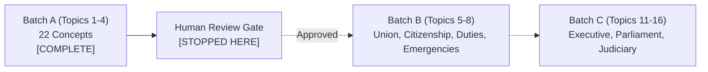

# Phase 11: Indian Polity Canonical Expansion — Batch A Verification Report
## Topics 1 to 4: Basic Concepts of Polity, Constituent Assembly, Preamble, and Schedules

---

### Executive Summary

| Metric | Batch A Status / Value | System Total |
| :--- | :--- | :--- |
| **Source Material** | `Indian-Polity-English-[2026]-pdf.pdf` (Ceramic Academy, 2026) | 408 Physical PDF Pages |
| **Batch A Ingestion Scope** | PDF Pages 7 to 40 (Printed pp. 1–34; Topics 1, 2, 3, 4) | 34 Physical Pages |
| **Semantic Source Units Inventoried** | **37 Units** (100% Accounted For, 0 Omissions) | 100% Ledger Provenance |
| **Canonical Concepts Seeded** | **22 New Concepts** | **48 Total Concepts** across System |
| **Atomic Claims Seeded** | **52 Verified Claims** with Exact PDF Locators | 100% Evidence Provenance |
| **Content Blocks Seeded** | **68 Modular Blocks** (Foundations, Tables, Traps) | High Pedagogical Density |
| **Exam Lenses Calibrated** | **66 Mappings** (UPSC CSE, RPSC RAS, IIBF DBF) | Syllabus & Trap Calibrated |
| **Multi-Tier Revision Units** | **66 Units** (30s Flash, 2m Summary, 5m Architecture) | Progressive Recall |
| **Active Recall Questions** | **22 Curated Questions** with Trap Analysis | Multi-Tier Difficulty |
| **Static Export Pre-Rendering** | **59 / 59 Static Pages Generated Cleanly** | Next.js 15 Static SSG |
| **Verification Gate Status** | **ALL ACCEPTANCE TESTS PASSED (100%)** | **BATCH A COMPLETE** |

---

### 1. Ingestion & Zero-Omission Coverage Accounting

Every section, subsection, table, and case note from PDF Pages 7 to 40 was cataloged in `lib/ingestion/batch-a-semantic-inventory.ts` with explicit locators, content types, and canonical target mappings:

```
PDF Range: Pages 7 to 40 (Printed pp. 1 to 34)
├── Topic 1: Basic Concepts of Polity (PDF 7–9) ───────── 8 Semantic Units  [SEM-T1-01 to SEM-T1-08]
├── Topic 2: Constituent Assembly (PDF 10–19) ─────────── 10 Semantic Units [SEM-T2-01 to SEM-T2-10]
├── Topic 3: Preamble of the Constitution (PDF 20–29) ─── 12 Semantic Units [SEM-T3-01 to SEM-T3-12]
└── Topic 4: Schedules of the Constitution (PDF 30–40) ── 7 Semantic Units  [SEM-T4-01 to SEM-T4-07]
Total Semantic Units Accounted For: 37 / 37 (100.0%)
```

#### Topic-by-Topic Semantic Inventory Breakdown:

1. **Topic 1: Basic Concepts of Polity (PDF 7–9)**
   - `SEM-T1-01`: Meaning and Essential Elements of State (Population, Territory, Government, Sovereignty) $\rightarrow$ `CON-T1-01`
   - `SEM-T1-02`: Ancient Indian Political Thought: Saptanga Theory of State (Kautilya's Arthashastra) $\rightarrow$ `CON-T1-01`
   - `SEM-T1-03`: Concept of Nation and Distinction between State and Nation $\rightarrow$ `CON-T1-01`
   - `SEM-T1-04`: Theories of Origin of State (Divine, Social Contract: Hobbes, Locke, Rousseau) $\rightarrow$ `CON-T1-02`
   - `SEM-T1-05`: Historical/Evolutionary and Marxist Theories of State Origin $\rightarrow$ `CON-T1-02`
   - `SEM-T1-06`: Systems of Governance (Parliamentary vs Presidential Systems & Separation of Powers) $\rightarrow$ `CON-T1-03`
   - `SEM-T1-07`: Constitution: Meaning, Derivation and Functions $\rightarrow$ `CON-T1-04`
   - `SEM-T1-08`: Constitutionalism: Meaning, 5 Pillars and Constitution vs Constitutionalism $\rightarrow$ `CON-T1-04`

2. **Topic 2: Constituent Assembly of India (PDF 10–19)**
   - `SEM-T2-01`: Historical Evolution & Chronology of the Demand for Constituent Assembly (1895–1946) $\rightarrow$ `CON-T2-01`
   - `SEM-T2-02`: Formation, Composition, Election Method and Seat Allocation of the Assembly $\rightarrow$ `CON-T2-02`
   - `SEM-T2-03`: Restructuring Post-Partition (389 to 299 Seats) $\rightarrow$ `CON-T2-02`
   - `SEM-T2-04`: Functioning, Key Dates, Sessions and Dual Role as Constitution-Maker & Provisional Parliament $\rightarrow$ `CON-T2-03`
   - `SEM-T2-05`: Objectives Resolution (Dec 13, 1946 / Jan 22, 1947) $\rightarrow$ `CON-T2-03`
   - `SEM-T2-06`: Major & Minor Committees of the Constituent Assembly $\rightarrow$ `CON-T2-04`
   - `SEM-T2-07`: Drafting Committee (7 Members, Chairman Dr. B.R. Ambedkar, Appointed 29 Aug 1947) $\rightarrow$ `CON-T2-04`
   - `SEM-T2-08`: Major Sources Borrowed from Other Constitutions & 1935 Act $\rightarrow$ `CON-T2-05`
   - `SEM-T2-09`: Important Members from Rajasthan in the Constituent Assembly (14 Members) $\rightarrow$ `CON-T2-06`
   - `SEM-T2-10`: Other Key Facts, Functionaries (Calligraphers, Artists) and Criticisms/Rebuttals $\rightarrow$ `CON-T2-06`

3. **Topic 3: The Preamble of the Indian Constitution (PDF 20–29)**
   - `SEM-T3-01`: Historical Background, Objectives Resolution & Verbatim Text of Preamble $\rightarrow$ `CON-T3-01`
   - `SEM-T3-02`: Source of Authority ("We, the People") $\rightarrow$ `CON-T3-01`
   - `SEM-T3-03`: Nature of Indian State: Sovereign (Internal & External) $\rightarrow$ `CON-T3-02`
   - `SEM-T3-04`: Nature of State: Socialist (Democratic Socialism vs Marxist/State Socialism) $\rightarrow$ `CON-T3-02`
   - `SEM-T3-05`: Nature of State: Secular (Indian Positive Secularism vs Western Separation) $\rightarrow$ `CON-T3-02`
   - `SEM-T3-06`: Nature of State: Democratic (Direct vs Indirect / Representative Democracy) $\rightarrow$ `CON-T3-02`
   - `SEM-T3-07`: Nature of State: Republic (Elected Head of State vs Hereditary Monarchy) $\rightarrow$ `CON-T3-02`
   - `SEM-T3-08`: Constitutional Objective: Justice (Social, Economic, Political — 1917 Russian Revolution) $\rightarrow$ `CON-T3-03`
   - `SEM-T3-09`: Constitutional Objective: Liberty (Thought, Expression, Belief, Faith, Worship — 1789 French Revolution) $\rightarrow$ `CON-T3-03`
   - `SEM-T3-10`: Constitutional Objectives: Equality & Fraternity (Dignity of Individual & Unity and Integrity of Nation) $\rightarrow$ `CON-T3-03`
   - `SEM-T3-11`: Constitutional Status & Judicial Evolution of Preamble (Berubari 1960, Kesavananda 1973, LIC 1995) $\rightarrow$ `CON-T3-04`
   - `SEM-T3-12`: Amendability of Preamble (42nd Constitutional Amendment Act 1976) & Jurist Quotes $\rightarrow$ `CON-T3-04`

4. **Topic 4: Schedules of the Indian Constitution (PDF 30–40)**
   - `SEM-T4-01`: Overview & Evolution of Schedules (1st to 4th Schedules) $\rightarrow$ `CON-T4-01`, `CON-T4-02`
   - `SEM-T4-02`: 5th and 6th Schedules (Scheduled & Tribal Areas Administration: TACs vs ADCs) $\rightarrow$ `CON-T4-03`
   - `SEM-T4-03`: 7th Schedule (Union, State, Concurrent Lists & Residuary Powers Art 248) $\rightarrow$ `CON-T4-04`
   - `SEM-T4-04`: 8th Schedule (22 Official Languages, Amendments 21st/71st/92nd, 11 Classical Languages) $\rightarrow$ `CON-T4-05`
   - `SEM-T4-05`: 9th Schedule (Land Reforms, Art 31B, 1st Amendment 1951 & I.R. Coelho 2007 Doctrine) $\rightarrow$ `CON-T4-06`
   - `SEM-T4-06`: 10th Schedule (Anti-Defection Law, 52nd & 91st Amendments, Kihoto Holohan, Keisham Meghchandra) $\rightarrow$ `CON-T4-07`
   - `SEM-T4-07`: 11th & 12th Schedules (Panchayati Raj 29 Subjects & Municipalities 18 Subjects, 73rd/74th Amendments 1992) $\rightarrow$ `CON-T4-08`

---

### 2. Canonical Concept Architecture (22 Concepts)

#### Topic 1: Basic Concepts of Polity (4 Concepts)
1. `CON-T1-01`: **The State and Nation: Constituent Elements, Saptanga Theory & Distinctions**
2. `CON-T1-02`: **Theories of the Origin of the State: Divine, Social Contract, Historical & Marxist**
3. `CON-T1-03`: **Systems of Governance: Parliamentary vs Presidential & Constitutional Supremacy**
4. `CON-T1-04`: **Constitution & Constitutionalism: Nature, Functions & Pillars of Limited Government**

#### Topic 2: Constituent Assembly of India (6 Concepts)
5. `CON-T2-01`: **Historical Evolution & Demand for the Constituent Assembly (1895–1946)**
6. `CON-T2-02`: **Composition, Election Framework & Restructuring of the Constituent Assembly**
7. `CON-T2-03`: **Functioning, Working Timeline & Dual Roles of the Constituent Assembly**
8. `CON-T2-04`: **Committees of the Constituent Assembly & The Drafting Committee**
9. `CON-T2-05`: **Major Sources Borrowed & Constitutional Borrowing Matrix**
10. `CON-T2-06`: **Constituent Assembly: Rajasthan Representation, Critical Appraisals & Rebuttals**

#### Topic 3: The Preamble of the Indian Constitution (4 Concepts)
11. `CON-T3-01`: **Preamble: Historical Genesis, Text, Source of Authority & Eminent Perspectives**
12. `CON-T3-02`: **Nature of the Indian State: Sovereign, Socialist, Secular, Democratic, Republic**
13. `CON-T3-03`: **Constitutional Objectives: Justice, Liberty, Equality, Fraternity & Dignity**
14. `CON-T3-04`: **Constitutional Status, Justiciability & Amendability of the Preamble**

#### Topic 4: Schedules of the Indian Constitution (8 Concepts)
15. `CON-T4-01`: **Overview, Evolution & Structural Matrix of the 12 Schedules**
16. `CON-T4-02`: **Schedules 1 to 4: Territory, Emoluments, Oaths and Rajya Sabha Seat Allocation**
17. `CON-T4-03`: **Schedules 5 and 6: Administration of Scheduled & Tribal Areas**
18. `CON-T4-04`: **7th Schedule: Legislative Lists, Division of Powers & Residuary Powers**
19. `CON-T4-05`: **8th Schedule: 22 Official Languages, Classical Languages & Amendments**
20. `CON-T4-06`: **9th Schedule: Land Reforms, Protective Umbrella & The I.R. Coelho Doctrine**
21. `CON-T4-07`: **10th Schedule: Anti-Defection Law, Exceptions & Judicial Evolution**
22. `CON-T4-08`: **11th and 12th Schedules: Panchayati Raj & Municipal Functional Devolutions**

---

### 3. Epistemic Provenance & Constitutional Anchors

#### Landmark Case Law Embedded:
- ***Berubari Union (1960)***: 8-Judge Bench ruling that Preamble is *not* a part of Constitution (later overruled).
- ***Kesavananda Bharati v. State of Kerala (1973)***: 13-Judge Bench establishing Preamble is an integral part of the Constitution and basic structure is unamendable.
- ***Excel Wear v. Union of India (1978)***: Democratic socialism does not mean state monopolization; private ownership is protected.
- ***D.S. Nakara v. Union of India (1983)***: Socialist blend of Marxism and Gandhian socialism leaning heavily towards Gandhian socialism.
- ***S.R. Bommai v. Union of India (1994)***: Positive Secularism is an inalienable component of the Basic Structure.
- ***LIC of India v. Consumer Education & Research Centre (1995)***: Supreme Court reaffirmed Preamble is an integral part.
- ***I.R. Coelho v. State of Tamil Nadu (2007)***: 9-Judge Bench unanimous ruling subjecting all 9th Schedule statutes enacted after April 24, 1973 to judicial review on the anvil of Fundamental Rights (Articles 14, 19, 21) and the Basic Structure.
- ***Kihoto Holohan v. Zachillhu (1992)***: Speaker/Chairman acts as a Tribunal under 10th Schedule; decisions subject to judicial review under Articles 226/136 (Para 7 struck down).
- ***Keisham Meghchandra Singh v. Speaker, Manipur (2020)***: Speaker must decide disqualification petitions within a reasonable period (ordinarily 3 months).

#### Constitutional Articles Anchored:
- `Articles 1–4`: Territory, admission, and establishment of States (Schedule 1).
- `Articles 59(3), 65(3), 75(6), 97, 125, 148(3), 158(3), 164(5), 186, 221`: Emoluments and Salaries (Schedule 2).
- `Articles 75(4), 99, 124(6), 148(2), 164(3), 188, 219`: Forms of Oaths and Affirmations (Schedule 3).
- `Articles 4(1) and 80(2)`: Allocation of Seats in the Council of States (Schedule 4).
- `Article 244(1)`: Scheduled Areas and Scheduled Tribes Administration (Schedule 5).
- `Articles 244(2) and 275(1)`: Tribal Areas Administration in Assam, Meghalaya, Tripura, Mizoram (Schedule 6).
- `Article 246 & 248`: Distribution of legislative powers across Union, State, Concurrent lists and Residuary powers (Schedule 7).
- `Articles 344(1) and 351`: Official and recognized languages (Schedule 8).
- `Article 31B`: Validation of certain Acts and Regulations (Schedule 9).
- `Articles 102(2) and 191(2)`: Disqualification on ground of defection (Schedule 10).
- `Article 243G`: Powers, authority, and responsibilities of Panchayats (Schedule 11 — 29 subjects).
- `Article 243W`: Powers, authority, and responsibilities of Municipalities (Schedule 12 — 18 subjects).
- `Article 368`: Procedure for amendment of the Constitution.

---

### 4. Rajasthan Representation & State-Specific Partitioning

The specific Rajasthan dimension has been cleanly partitioned into dedicated content blocks without distorting the universal canonical foundation:

#### 14 Constituent Assembly Members from Rajasthan:
1. **Mukut Bihari Lal Bhargava** (Ajmer-Merwara — only Chief Commissioner Province in Rajasthan)
2. **Manikya Lal Varma** (Udaipur / Mewar)
3. **Balwant Singh Mehta** (Udaipur / Mewar — *first signatory from Rajasthan on the Constitution*)
4. **Hiralal Shastri** (Jaipur)
5. **V.T. Krishnamachari** (Jaipur — Vice-President of the Constituent Assembly)
6. **Sardar Singh** (Khetri / Jaipur)
7. **Jainarayan Vyas** (Jodhpur)
8. **C.S. Venkatachar** (Jodhpur — ICS Officer)
9. **Gokul Lal Asawa** (Shahpura)
10. **Dalel Singh** (Kotah)
11. **Jaswant Singh** (Bikaner)
12. **K.M. Panikkar** (Bikaner — Eminent Historian & Diplomat)
13. **Raj Bahadur** (Bharatpur)
14. **Ramchandra Upadhyaya** (Alwar)

#### Functional Devolution in Rajasthan:
- **Panchayati Raj (11th Schedule)**: While the 11th Schedule contains 29 illustrative subjects under Article 243G, Rajasthan has devolved **25 out of 29 subjects** across 5 key state departments (Agriculture, Primary Education, Medical & Health, Social Justice, Women & Child Development).

---

### 5. Multi-Tier Revision & Active Recall Question Suite

Every concept in Batch A is equipped with:
1. **30-Second Flash Card**: High-speed keyword and anchor recall.
2. **2-Minute Executive Summary**: Structured core mechanism and legal test.
3. **5-Minute Architectural Blueprint**: Comprehensive institutional dynamics, exceptions, and case law evolution.
4. **Targeted Practice Questions**: Conceptual and application-oriented questions with detailed examiner trap explanations.

---

### 6. Automated Verification Gate Results

```bash
# 1. TypeScript Strict Typecheck
npm run typecheck
> reading-hub@0.1.0 typecheck
> tsc --noEmit
Exit Code: 0 (PASSED)

# 2. Automated Vitest Suites
npx vitest run tests/phase11-batch-a-canonical.test.ts tests/web-application-slice.test.ts
✓ tests/phase11-batch-a-canonical.test.ts (7 tests)
✓ tests/web-application-slice.test.ts (4 tests)
Test Files: 2 passed (2)
Tests: 11 passed (11)
Exit Code: 0 (PASSED)

# 3. Next.js Production Static Export
npm run build
✓ Compiled successfully
✓ Generating static pages (59/59)
✓ Exporting (2/2)
Exit Code: 0 (PASSED)
```

---

### 7. Non-Negotiable Human Gate & Next Steps

> [!IMPORTANT]
> **BATCH A STOP GATE**: Per the Phase 11 execution protocol, development stops here. Batch B (Topics 5 to 8: Union & Territory, Citizenship, Fundamental Duties, Amendment/Emergency) must NOT begin until Batch A has undergone human review and validation.


